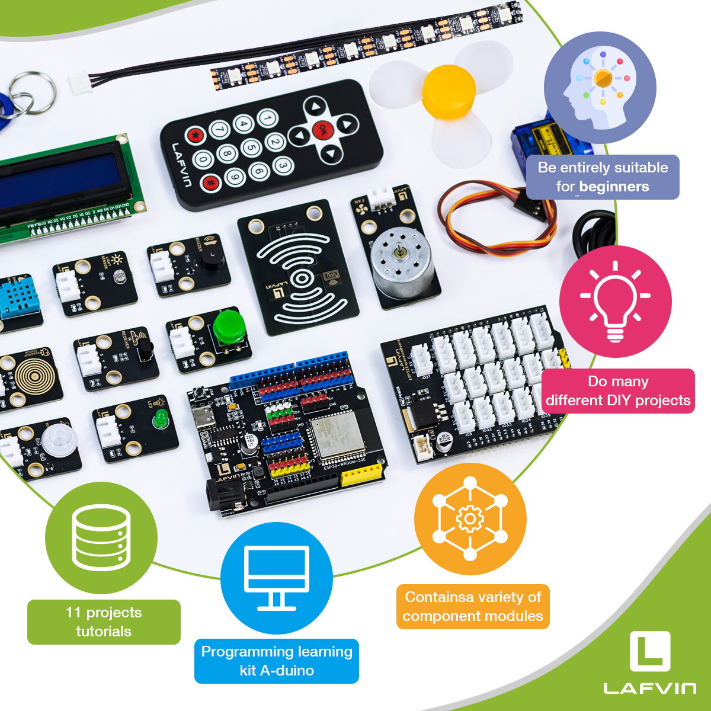
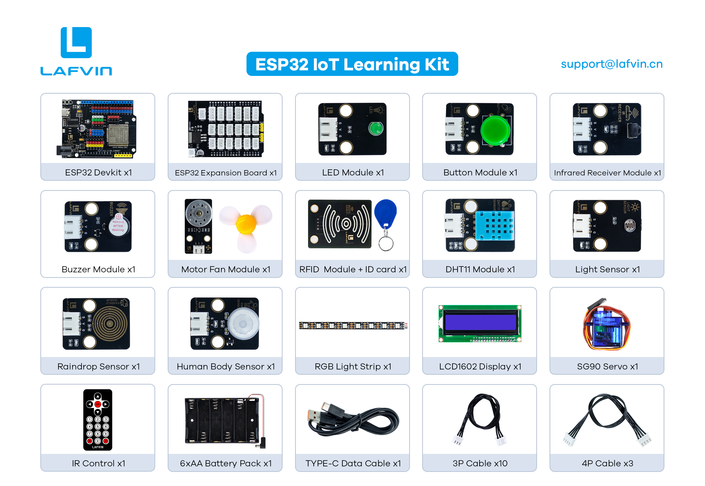

**Thank you for choosing the Lafvin ESP32 IoT Learning Kit.**

**Please read this documentation carefully. If you encounter any problems during use, please contact our after-sales support team, and we will assist you as soon as possible.**

----

**ESP32 IOT Learning Kit**

----

Introduction
============

*This kit uses the ESP32 as its core controller and integrates a variety of common sensors and actuator modules, resulting in a rich system with wide applicability. Its key features and advantages are as follows:*

1. Multifunctional Integration
Supports Wi-Fi communication and web control for remote monitoring and interaction.
Provides sensor detection, servo control, LCD display, and environmental monitoring functions, covering the core modules of IoT applications.
Suitable for a variety of experimental scenarios, from basic learning to comprehensive applications.

2. Suitable Audience and Scenarios
Suitable for beginners of electronics and IoT for learning and practice.
Can be used for maker education in primary and secondary schools, Arduino programming teaching, and laboratory project research.
It is also suitable for smart home prototype development, helping users quickly master the core principles of intelligent control and IoT applications.

3. Hardware Design Advantages
Using the ESP32 development board and dedicated expansion board design, the modules are standardized and the interfaces are unified.
All modules use the XH2.54 interface with reverse polarity protection to ensure secure connections.
Module interconnection can be completed without a breadboard, simplifying wiring, improving experimental efficiency, and enhancing ease of use.

4. Abundant Course Resources
Provides comprehensive course resources covering over ten common sensors and actuator modules.
The course content progresses step-by-step, from basic introductory techniques to comprehensive applications.
Each experiment features a web control interface, making it both engaging and practical.

5. Skill Acquisition and Application
Master ESP32 programming using the Arduino IDE.
Proficient in reading digital and analog sensor data.
Understand Wi-Fi connectivity and web server design, and master methods for environmental data collection and multi-module linkage control.
Develop a deep understanding of the working principles of RFID sensing and identification.
Be able to implement real-time IoT web monitoring and remote interaction, demonstrating practical IoT system development capabilities.

----

Bill of Materials
-----------------

.. list-table:: Bill of Materials
   :header-rows: 1
   :widths: 10 40 20
   :align: center

   * - Serial Number
     - Name
     - Quantity
   * - 1
     - ESP32 Devkit
     - x1
   * - 2
     - ESP32 Expansion Board
     - x1
   * - 3
     - LED Module
     - x1
   * - 4
     - Button Module
     - x1
   * - 5
     - Infrared Receiver Module
     - x1
   * - 6
     - Buzzer Module
     - x1
   * - 7
     - Motor Fan Module
     - x1
   * - 8
     - RFID Module + ID card
     - x1
   * - 9
     - DHT11 Temperature and Humidity Sensor
     - x1
   * - 10
     - Light Sensor
     - x1
   * - 11
     - Raindrop Sensor
     - x1
   * - 12
     - Human Body Sensor
     - x1
   * - 13
     - RGB Light Strip
     - x1
   * - 14
     - LCD1602 Display
     - x1
   * - 15
     - SG90 Servo
     - x1
   * - 16
     - Infrared remote control
     - x1
   * - 17
     - 6xAA Battery Pack
     - x1
   * - 18
     - TYPE-C Data Cable
     - x1
   * - 19
     - 3P Cable
     - x10
   * - 20
     - 4P Cable
     - x3

Upon receiving the kit, please first check all components against the above bill of materials. If you find any missing or damaged items, please contact our technical support team immediately.

----

Resource Download
-----------------

All the necessary code and library files for this course are provided. You can obtain all the resources through the following link.

`Code and Libraries <https://www.dropbox.com/scl/fo/sl9z0sjm05r91bp1ydpow/ADg7koIZM07COmi8Y_GyPWE?rlkey=odmym388yz5bqwd5xhbzzn2zi&st=4w7j8l23&dl=1>`_

`Flash Download Tool <https://www.dropbox.com/scl/fo/r81afjixw65y88jikwxno/AM8XTGDtfcEJDgN0jHyMbRY?rlkey=4lvaoh0axd9nhvk9al7qukoi5&st=1hqtehms&dl=1>`_

`CH340 <https://www.dropbox.com/scl/fo/c4bb59fr42qcs9cxgexan/AIMImtqevecMqYNMJVK1ZBM?rlkey=9afntuwy2usxfxbl7xjkoirsy&st=89a5bx6b&dl=1>`_

----

**Next, we will delve into the core content of the course and help you gradually understand the relevant concepts and master the operation procedures.**

----
