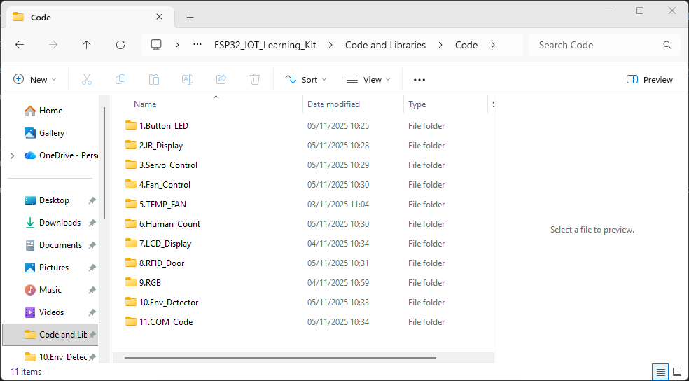
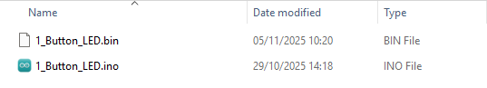
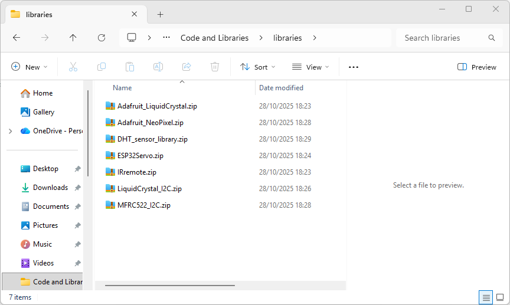
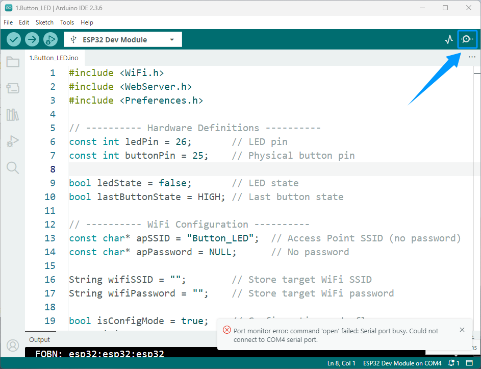
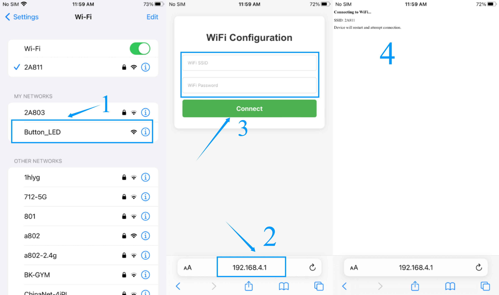
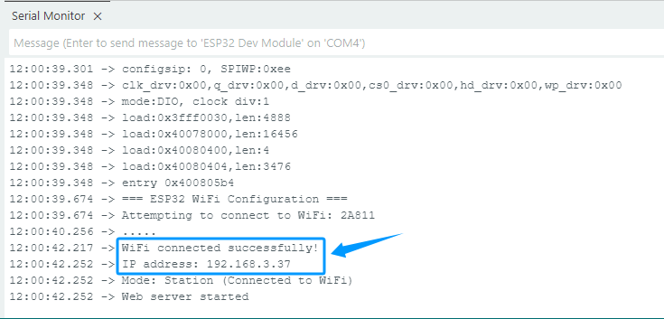

Pre-Class Preparation
=====================

Check Resources
---------------

Before you begin learning, please ensure that you have downloaded all the resource packages we provide, which include source code files, firmware files, and necessary library files, to ensure that the subsequent lessons can proceed smoothly.

All the necessary code and library files for this course are provided. You can obtain all the resources through the following link.

`Code and Libraries <https://www.dropbox.com/scl/fo/syf1zstu58f4xlcld2nss/ACJOi93PcIafo5yGabrprDA?rlkey=hoc2undykymrxac7z8nclpk9u&st=el86zaw9&dl=1>`_

1. The **Code** folder contains the following 11 folders.

.. raw:: html

   

2. Each folder contains two files.
  - .ino files are used for programming with the Arduino IDE; 
  - .bin files are used for programming with Flash Download Tool.

3. The **libraries** folder contains the following 7 compressed files, which do not need to be extracted. 

   Import them directly into the Arduino IDE. Click here for import instructions. :ref:`Add Libraries`.

----

.. _Configure network:

Configure network
-----------------

In the following lessons, we will use a web page to control the device multiple times. 

To ensure that the web control function works properly, please be sure to follow the steps below to complete the network configuration and successfully connect your ESP32 device to the WiFi network.

1. After programming, open the serial monitor in the Arduino IDE and press the **RST** button on the ESP32 development board.

.. raw:: html

   

2. The ESP32 development board will generate a hotspot named after the title of each course; we'll use the first course as an example here.

.. raw:: html

   

3. Turn on your phone's Wi-Fi and find and connect to the hotspot name emitted by your device. Once connected, open your phone's browser and enter **192.168.4.1** in the address bar to access the network configuration interface. Then, enter your home Wi-Fi name and password to complete the device's network setup.

.. raw:: html

   

4. Open the serial monitor and wait for the device to connect successfully. The assigned IP address will then be displayed. Enter this IP address into your browser's address bar to open the device control page.

----

.. admonition:: Precaution

 The firmware burned using the Flash Download Tool can also have its IP address viewed through the Arduino IDE's serial monitor.

 Please ensure that the WiFi network entered on the network configuration page is the same as the WiFi network your phone is connected to; otherwise, you will not be able to access the web control page through your browser.

 The program has a built-in power-off memory function, so you usually only need to configure the network once. Afterwards, even if you power on the device again or flash a new program, it will automatically connect to the previously configured Wi-Fi. If you cannot connect normally, please repeat the network configuration steps above.
 
 The device's IP address may change each time it connects to WiFi. If you cannot access the control page after connecting to WiFi, please open the serial monitor in the Arduino IDE and press the reset button on the ESP32 development board. After resetting, the serial port will output a new IP address. Please enter this new address in your browser to access the control page.

----