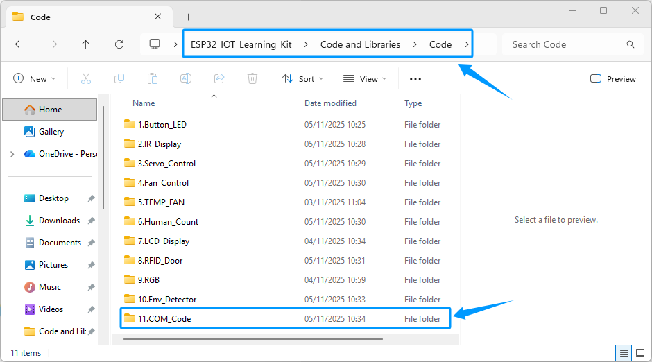
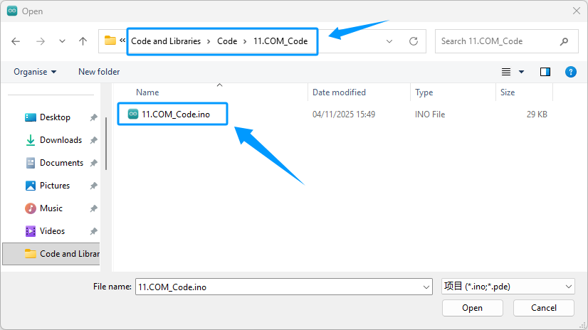
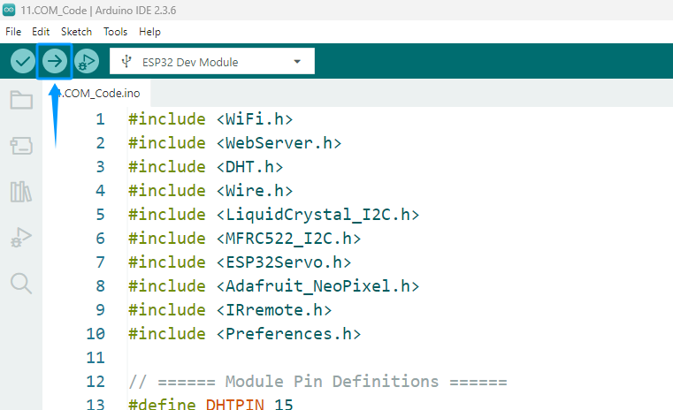
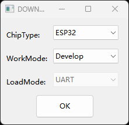

Upload Code To ESP32
====================

 There are two ways to flash the firmware. If you have already installed the Arduino IDE and CH340 drivers and successfully downloaded the ESP32 core package and necessary libraries, you can continue to flash the firmware in the Arduino IDE by following the steps below. 
 
 If you want to experience the features of this kit more quickly or encounter problems during the Arduino IDE installation, you can also click this link to use Espressif's official flashing tool to flash the firmware to the ESP32 development board, which is simpler and faster. :ref:`Flash Download Tool`.

----

.. _Arduino IDE burning program:

Option 1: Arduino IDE
--------------------
After completing the previous steps, ensure that the CH340 serial port driver has been installed, the ESP32 core package has been downloaded and installed, and the required library files have been imported. At this point, you can upload the code to the ESP32 development board and start running the program.

----

Download the Code
~~~~~~~~~~~~~~~~~

1. Click the link below to download the code we prepared. The complete code path is: **Code and Libraries** → **Code** → **11.COM_Code**.
`Download Code <https://www.dropbox.com/scl/fi/j6oue7pij59qyy9cwqclh/CH34x_Install_Windows_v3_4.zip?rlkey=xttzwik1qp56naxw8v7ostmkq&e=1&st=kcy0xjl1&dl=0>`_

.. raw:: html

   

.. note::

   The example code examples numbered 1–10 are step-by-step tutorials, with each example demonstrating the functionality of 1–3 modules. If you wish to experience the full functionality of all modules, please directly use example code example number 11 for flashing.

2. Cick **File → Open** in Arduino IDE.  

3. In the pop-up window, locate the downloaded code, select the corresponding folder or file, and click **Open**.  

.. image:: _static/36.upload.png
   :width: 800
   :align: center

.. raw:: html

   

----

Select a Development Board
~~~~~~~~~~~~~~~~~~~~~~~~~~

Select **Tools → Board → ESP32 → ESP32 Dev Module** in Arduino IDE.  

.. image:: _static/33.upload1.png
   :width: 800
   :align: center

----

Select the Serial Port
~~~~~~~~~~~~~~~~~~~~~~

Select the correct serial port: **Tools → Port → COMx**.  
COMx should match the port of the connected ESP32 development board.  

.. image:: _static/34.port.png
   :width: 600
   :align: center

----

Check Board and Port Selection
~~~~~~~~~~~~~~~~~~~~~~~~~~~~~~
- Please refer to the diagram to verify whether the selected board and serial port are correct.  
- If the selection is incorrect or missing, return to the previous steps to set it again.  

.. image:: _static/35.upload.png
   :width: 600
   :align: center

----
   
Upload Code
~~~~~~~~~~~

1. Click the **Upload** icon in Arduino IDE. The system will automatically compile and upload the code to the ESP32 development board.  

.. raw:: html

   

2. The Output window will display the compilation and upload progress. The process may be slow, so please wait patiently until the code is successfully uploaded.  

.. image:: _static/40.upload.png
   :width: 600
   :align: center

.. raw:: html

   

3. When the message **"Leaving... Hard resetting via RTS pin..."** appears in the Output window, the code has been uploaded successfully. Press the **RST** button on the ESP32 board to start running the program.  

.. image:: _static/41.upload.png
   :width: 600
   :align: center
   
.. raw:: html

   

.. note::

   - If the code fails to upload, follow these troubleshooting steps:
   - Confirm that the selected port in **Tools → Port** corresponds to the connected ESP32 board.  
   - Confirm that the correct ESP32 board model is selected in **Tools → Board**.  
   - Ensure that the CH340 serial driver （or other required USB driver）is installed and the board is recognized in the device manager.  
   - Try changing the USB port or using a different USB data cable that supports data transfer.  
   - Confirm that the ESP32 core package is installed and all required libraries are imported.  
   - Use the recommended library versions; mismatched versions may cause compilation or upload errors.  
   - Make sure no other program is using the serial port, such as Serial Monitor or other tools.  
   - If upload fails, press the **RST** button on the ESP32 board and try again.  

----

.. _Flash Download Tool:

Option 2: Flash Download Tool
---------------------------

**Of course, if you find the above steps cumbersome or encounter unresolved errors during the Arduino IDE flashing process, you can also use Espressif's official flashing tool.We've packaged the complete program as a bin file. You can flash the firmware directly to your ESP32 development board without importing libraries or downloading the ESP32 core package, helping you quickly and conveniently experience the full capabilities of this kit.**

----

Install CH340 Driver
~~~~~~~~~~~~~~~~~~~

- Similarly, before using Espressif's official flashing tool, you must first install the CH340 driver so that the ESP32 development board can communicate properly with your computer. If the CH340 driver is not installed, please see the CH340 driver installation tutorial page: See :ref:`install_ch340_driver` for detailed instructions.

----

Download burning tools
~~~~~~~~~~~~~~~~~~~

1. You can directly click this link to download the burning tool installation package we prepared. `Burning tool installation package, <https://www.dropbox.com/scl/fo/r81afjixw65y88jikwxno/AM8XTGDtfcEJDgN0jHyMbRY?rlkey=4lvaoh0axd9nhvk9al7qukoi5&st=1hqtehms&dl=1>`_ Or refer to the following steps to download the latest installation package provided by Espressif's official website

2. Click this link to enter Espressif's official burning tool download page.  
   `Espressif Burning Tool <https://www.espressif.com.cn/zh-hans/support/download/other-tools>`_

.. raw:: html

   

.. image:: _static/42.TOOL.png
   :width: 600
   :align: center

.. raw:: html

   

3. Click the Download button in the image to automatically download Espressif's official programming tool. The tool's features and instructions are also provided at the bottom of the page. If you're interested, please read and learn more.

.. raw:: html

   

.. image:: _static/43.TOOL.png
   :width: 600
   :align: center

.. raw:: html

   

4. After decompressing the downloaded compressed file, you will see several files contained in it, as shown in the figure below.

.. raw:: html

   

.. image:: _static/44.TOOL.png
   :width: 600
   :align: center

.. raw:: html

   

5. Click this link to download the bin firmware file we prepared for you.  
   `Download firmware <https://www.dropbox.com/scl/fi/j6oue7pij59qyy9cwqclh/CH34x_Install_Windows_v3_4.zip?rlkey=xttzwik1qp56naxw8v7ostmkq&e=1&st=kcy0xjl1&dl=0>`_

6. Move the downloaded bin firmware file to the bin folder in the previously downloaded and unzipped burning tool directory.

----

Burn firmware
~~~~~~~~~~~~~

1. Connect the ESP32 development board to the computer via a USB cable and make sure the computer can correctly identify the corresponding serial port.

2. Double-click to open the burning tool.

.. image:: _static/45.TOOL.png
   :width: 600
   :align: center

3. On the pop-up page, select **ESP32** from the "Chip Type" drop-down menu, select **Develop** from the "WorkMode" drop-down menu, and leave **UART** as the default setting for "LoadMode". Click **OK** when finished.

.. raw:: html

   

4. Follow the instructions in the picture to import the downloaded firmware named ".10.SmartHome_CompleteCode", check the firmware file in the box on the left of the software interface, and enter "0" in the box on the right to complete the settings for importing the firmware.

.. image:: _static/47.TOOL.png
   :width: 600
   :align: center

.. raw:: html

   

.. image:: _static/63.bin.png
   :width: 800
   :align: center

.. raw:: html

   

5. Set the parameters as shown in the picture: **SPI SPEED** select **80MHz**, **SPI MODE** select **DIO**, **COM** select the serial port actually connected to the computer, and **BAUD** set to **921600**.

.. image:: _static/48.TOOL.png
   :width: 600
   :align: center

.. raw:: html

   

6. After completing the above settings, click the **START** button and the system will automatically start burning the firmware. Please wait patiently for the burning to complete.

.. image:: _static/49.TOOL.png
   :width: 600
   :align: center

.. raw:: html

   

7. After the burning is completed, the interface will display the **FINISH** prompt. At this time, press the RST reset button on the ESP32 development board and the system will start running.

.. image:: _static/50.TOOL.png
   :width: 600
   :align: center

.. raw:: html

   

.. note::

   If the flashing process fails, please follow these steps:

   - Confirm that the ESP32 development board is properly connected to the computer via a USB cable and that the CH340 driver is installed.
   - Check that COMx in the flashing tool is the actual serial port number.
   - Confirm that the firmware file is correctly placed in the BIN folder and check the box on the left.
   - Verify the flashing parameter settings: SPI SPEED = 80MHz, SPI MODE = DIO, BAUD = 921600.
   - Try changing the USB cable or USB port to eliminate communication issues.
   - If flashing still fails, restart the computer and development board and try again.

----