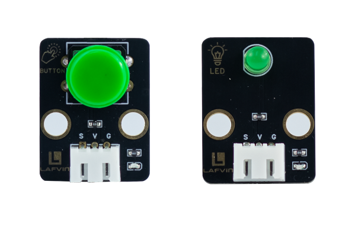
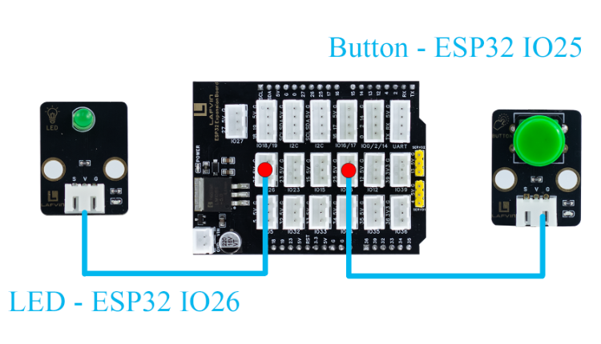
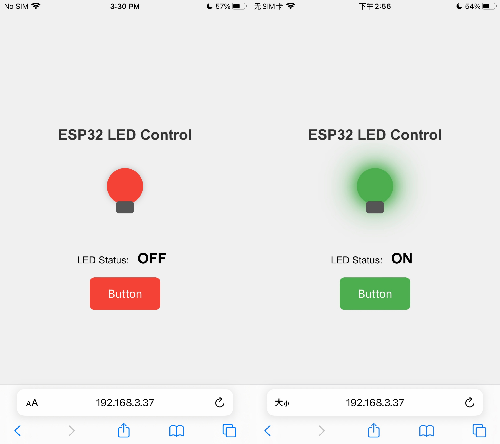

Course 1：Button_LED
====================

----

Learning Objectives
-------------------

1. Master the basic principles of ESP32 digital input/output; 
2. Build a web server based on ESP32 to achieve remote control via web page; 
3. Understand the synchronization mechanism between physical buttons and web page control; 
4. Be familiar with the interaction between the HTML + CSS + JavaScript front-end and the ESP32 back-end; 
5. Ultimately, complete a simple and aesthetically pleasing LED control system with real-time status updates.

----

Required Component
------------------

 - LED Module、Button Module

----

Working Principle
-----------------

 - LED Module：LED（Light Emitting Diode）is a semiconductor device that converts electrical energy into light energy. Its working principle is based on the electron-hole recombination effect when a PN junction is forward-biased, resulting in light emission.
 - Button Module：Structurally, it is a mechanical contact switch. When pressed, the two contacts close, and the circuit is completed; when released, the contacts open, and the circuit is broken.

----

Wiring
------

 - LED Module —— ESP32 IO26
 - Button Module —— ESP32 IO25

----

Example Code
------------

.. code-block:: cpp

    #include <WiFi.h>
    #include <WebServer.h>
    #include <Preferences.h>

    // ---------- Hardware Definitions ----------
    const int ledPin = 26;       // LED pin
    const int buttonPin = 25;    // Physical button pin

    bool ledState = false;       // LED state
    bool lastButtonState = HIGH; // Last button state

    // ---------- WiFi Configuration ----------
    const char* apSSID = "Button_LED";  // Access Point SSID (no password)
    const char* apPassword = NULL;      // No password

    String wifiSSID = "";        // Store target WiFi SSID
    String wifiPassword = "";    // Store target WiFi password

    bool isConfigMode = true;    // Configuration mode flag
    bool wifiConnected = false;  // WiFi connection status

    // ---------- Create Web Server ----------
    WebServer server(80);

    // ---------- Preferences for storing WiFi credentials ----------
    Preferences preferences;

    // ---------- HTML Configuration Page ----------
    String configHTMLPage() {
      String html = "<!DOCTYPE html><html><head>";
      html += "<title>ESP32 WiFi Configuration</title>";
      html += "<meta name='viewport' content='width=device-width, initial-scale=1.0'>";
      html += "</head><body>";
      
      html += "
";
      html += "<h2>WiFi Configuration</h2>";
      
      html += "<form action='/configure' method='POST'>";
      html += "<input type='text' name='ssid' placeholder='WiFi SSID' required>";
      html += "<input type='password' name='password' placeholder='WiFi Password' required>";
      html += "<button type='submit'>Connect</button>";
      html += "</form>";
      
      html += "
</body></html>";
      return html;
    }

    // ---------- HTML Control Page (Original Design) ----------
    String controlHTMLPage() {
      String html = "<!DOCTYPE html><html><head>";
      html += "<title>ESP32 LED Control</title>";
      html += "<meta name='viewport' content='width=device-width, initial-scale=1.0'>";
      html += "</head><body>";

      html += "<h2>ESP32 LED Control</h2>";

      html += "

";
      html += "
LED Status: " + String(ledState ? "ON" : "OFF") + "
";
      html += "<button id='ledButton' class='" + String(ledState ? "on" : "off") + "' onclick='toggleLED()'>Button</button>";

      html += "";

      html += "</body></html>";
      return html;
    }

    // ---------- Setup Routes ----------
    void setupRoutes() {
      server.on("/", {
        if (isConfigMode) {
          server.send(200, "text/html", configHTMLPage());
        } else {
          server.send(200, "text/html", controlHTMLPage());
        }
      });
      
      server.on("/configure", HTTP_POST, {
        wifiSSID = server.arg("ssid");
        wifiPassword = server.arg("password");
        
        // Save credentials to preferences
        preferences.putString("ssid", wifiSSID);
        preferences.putString("password", wifiPassword);
        
        server.send(200, "text/html", 
                    "<html><body><h2>Connecting to WiFi...</h2>"
                    "
SSID: " + wifiSSID + "
"
                    "
Device will restart and attempt connection.
"
                    ""
                    "</body></html>");
        
        delay(2000);
        ESP.restart();
      });
      
      server.on("/toggle", {
        ledState = !ledState;
        server.send(200, "text/plain", ledState ? "1" : "0");
      });
      
      server.on("/state", {
        server.send(200, "text/plain", ledState ? "1" : "0");
      });
    }

    // ---------- Connect to WiFi ----------
    bool connectToWiFi() {
      if (wifiSSID == "") return false;
      
      Serial.println("Attempting to connect to WiFi: " + wifiSSID);
      WiFi.begin(wifiSSID.c_str(), wifiPassword.c_str());
      
      int attempts = 0;
      while (WiFi.status() != WL_CONNECTED && attempts < 20) {
        delay(500);
        Serial.print(".");
        attempts++;
      }
      
      if (WiFi.status() == WL_CONNECTED) {
        Serial.println("\nWiFi connected successfully!");
        Serial.println("IP address: " + WiFi.localIP().toString());
        return true;
      } else {
        Serial.println("\nFailed to connect to WiFi");
        return false;
      }
    }

    // ---------- Setup Access Point ----------
    void setupAccessPoint() {
      Serial.println("Setting up Access Point...");
      WiFi.softAP(apSSID, apPassword);
      Serial.println("Access Point started");
      Serial.println("SSID: " + String(apSSID));
      Serial.println("Password: None (Open Network)");
      Serial.println("IP address: " + WiFi.softAPIP().toString());
    }

    // ---------- Setup ----------
    void setup() {
      Serial.begin(115200);
      
      // Initialize hardware
      pinMode(ledPin, OUTPUT);
      pinMode(buttonPin, INPUT_PULLUP);
      
      // Initialize preferences
      preferences.begin("wifi-config", false);
      
      // Try to load saved WiFi credentials
      wifiSSID = preferences.getString("ssid", "");
      wifiPassword = preferences.getString("password", "");
      
      Serial.println("=== ESP32 WiFi Configuration ===");
      
      if (wifiSSID != "" && connectToWiFi()) {
        // Successfully connected to WiFi
        isConfigMode = false;
        wifiConnected = true;
        Serial.println("Mode: Station (Connected to WiFi)");
      } else {
        // Enter configuration mode (Access Point)
        isConfigMode = true;
        wifiConnected = false;
        setupAccessPoint();
        Serial.println("Mode: Access Point (Configuration)");
      }
      
      setupRoutes();
      server.begin();
      Serial.println("Web server started");
    }

    // ---------- Main Loop ----------
    void loop() {
      server.handleClient();

      // Button detection with debouncing
      bool buttonState = digitalRead(buttonPin);
      if (buttonState == LOW && lastButtonState == HIGH) {
        ledState = !ledState;
        delay(50); // Simple debouncing
      }
      lastButtonState = buttonState;

      // Control LED
      digitalWrite(ledPin, ledState ? HIGH : LOW);
    }

----

**Code burning options**

1. You can directly copy the code provided above into the Arduino IDE for burning.

2. Find the **1.Button_LED.ino** file in the provided folder, download it, open it with the **Arduino IDE**, and burn the program to the ESP32 development board.

3. Find the **1.Button_LED.bin** file in the provided folder, download it and use **Flash Download Tool** to flash the program to the ESP32 development board. 

----

Effects Demonstration
---------------------

1. Press the button to turn on the LED light, and press it again to turn it off.

2. After opening the web control page, clicking the button on the webpage controls the LED light's on/off state.

3. The webpage button and the physical button achieve synchronized control; operation on either will update the other's status in real time, enabling two-way linkage.

.. code-block:: cpp
 
    server.on("/", {
        server.send(200, "text/html", HTMLPage());
    });

    server.on("/toggle", {
        ledState = !ledState;
        server.send(200, "text/plain", ledState ? "1" : "0");
    });

    server.on("/state", {
        server.send(200, "text/plain", ledState ? "1" : "0");
    });

*/toggle is used to toggle the LED state, and /state is used to read the LED state in real time via a webpage.*

----
