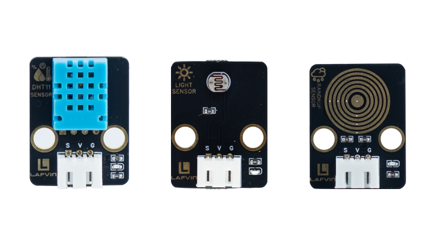
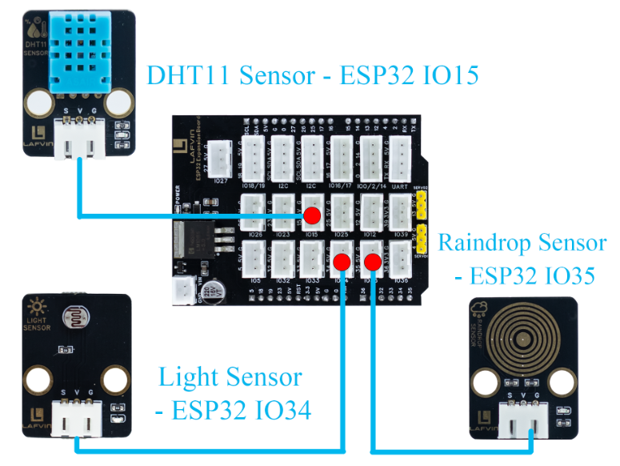
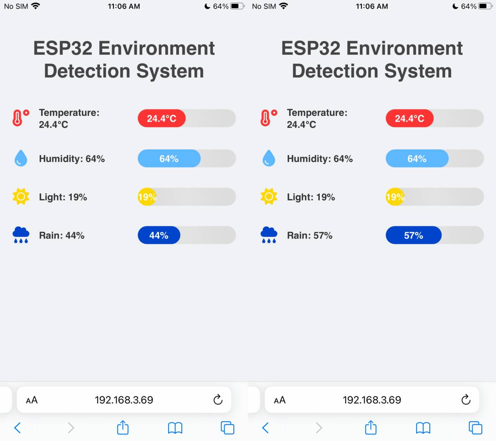

Course 10：Env_Detector
======================

----

Learning Objectives
-------------------

 - Learn environmental sensor data acquisition techniques, master the use of DHT11, photosensors, and raindrop sensors, and understand JSON data communication.

 - Learn to achieve multi-source data acquisition through ADC analog input and digital signal reading.

----

Required Component
------------------

 - DHT11 Sensor、Light Sensor、Raindrop Sensor

----

Working Principle
-----------------

 - Light Sensor:The core component of a photosensitive brightness sensor is a photoresistor, a semiconductor device whose resistance changes with light intensity. When the light intensity increases, photons are absorbed by the material, generating more free electrons, thus reducing resistance and increasing current; when the light intensity decreases, the number of free electrons decreases, increasing resistance and decreasing current.
 - Raindrop Sensor:A rain sensor mainly consists of a sensing plate and a comparison module（signal processing circuit）. The surface of the sensing plate has a layer of conductive lines. When water droplets fall on the surface, the conductive liquid（water）creates a path between the electrodes, resulting in a decrease in resistance and an increase in current.

----

Wiring
--------

 - DHT11 Sensor —— ESP32 IO15
 - Light Sensor —— ESP32 IO34
 - Raindrop Sensor —— ESP32 IO35

----

Example Code
------------

.. code-block:: cpp

   #include <WiFi.h>
   #include <WebServer.h>
   #include <DHT.h>
   #include <Preferences.h>

   // ===== Pin Definitions =====
   #define DHTPIN 15
   #define DHTTYPE DHT11
   #define LIGHT_PIN 34
   #define RAIN_PIN 35

   DHT dht(DHTPIN, DHTTYPE);
   WebServer server(80);

   // ===== Sensor Data =====
   float temperature = 0;
   float humidity = 0;
   int lightPercent = 0;
   int rainPercent = 0;

   // ===== WiFi Configuration =====
   const char* apSSID = "Env_Detector";  // Access Point SSID (no password)
   const char* apPassword = NULL;        // No password

   String wifiSSID = "";        // Store target WiFi SSID
   String wifiPassword = "";    // Store target WiFi password

   bool isConfigMode = true;    // Configuration mode flag
   bool wifiConnected = false;  // WiFi connection status

   // ===== Preferences for storing WiFi credentials =====
   Preferences preferences;

   // ===== Read Sensors =====
   void readSensors() {
     temperature = dht.readTemperature();
     humidity = dht.readHumidity();

     int lightVal = analogRead(LIGHT_PIN);
     lightPercent = map(lightVal, 0, 4095, 0, 100);
     if(lightPercent>100) lightPercent=100;

     int rainVal = analogRead(RAIN_PIN);
     rainPercent = map(rainVal, 0, 4095, 0, 100);
     if(rainPercent>100) rainPercent=100;
   }

   // ===== Return Data JSON =====
   void handleData() {
     readSensors();
     String json = "{";
     json += "\"temperature\":" + String(temperature) + ",";
     json += "\"humidity\":" + String(humidity) + ",";
     json += "\"light\":" + String(lightPercent) + ",";
     json += "\"rain\":" + String(rainPercent);
     json += "}";
     server.send(200,"application/json",json);
   }

   // ===== HTML Configuration Page =====
   String configHTMLPage() {
     return R"rawliteral(
   <!DOCTYPE html>
   <html lang="en">
   <head>
   <meta charset="UTF-8">
   <meta name="viewport" content="width=device-width, initial-scale=1.0">
   <title>ESP32 WiFi Configuration</title>
   
   </head>
   <body>
     

       <h1>WiFi Configuration</h1>
       <form action="/configure" method="POST">
         <input type="text" name="ssid" placeholder="WiFi SSID" required>
         <input type="password" name="password" placeholder="WiFi Password" required>
         <button type="submit">Connect</button>
       </form>
     

   </body>
   </html>
   )rawliteral";
   }

   // ===== Control Web Page =====
   String controlHTMLPage() {
     return R"rawliteral(
   <!DOCTYPE html>
   <html lang="en">
   <head>
   <meta charset="UTF-8">
   <meta name="viewport" content="width=device-width, initial-scale=1.0">
   <title>ESP32 Environment Detection System</title>
   
   <link rel="stylesheet" href="https://cdnjs.cloudflare.com/ajax/libs/font-awesome/6.4.0/css/all.min.css">
   </head>
   <body>
   <h1>ESP32 Environment Detection System</h1>

   

     
<i class="fas fa-temperature-high"></i>

     
Temperature: 0°C

     

0°C

   

   

     
<i class="fas fa-tint"></i>

     
Humidity: 0%

     

0%

   

   

     
<i class="fas fa-sun"></i>

     
Light: 0%

     

0%

   

   

     
<i class="fas fa-cloud-rain"></i>

     
Rain: 0%

     

0%

   

   
   </body>
   </html>
   )rawliteral";
   }

   // ===== Route Handlers =====
   void handleRoot() {
     if (isConfigMode) {
       server.send(200, "text/html", configHTMLPage());
     } else {
       server.send(200, "text/html", controlHTMLPage());
     }
   }

   void handleConfigure() {
     wifiSSID = server.arg("ssid");
     wifiPassword = server.arg("password");
     
     // Save credentials to preferences
     preferences.putString("ssid", wifiSSID);
     preferences.putString("password", wifiPassword);
     
     server.send(200, "text/html", 
                 "<html><body><h2>Connecting to WiFi...</h2>"
                 "
SSID: " + wifiSSID + "
"
                 "
Device will restart and attempt connection.
"
                 ""
                 "</body></html>");
     
     delay(2000);
     ESP.restart();
   }

   // ===== Connect to WiFi =====
   bool connectToWiFi() {
     if (wifiSSID == "") return false;
     
     Serial.println("Attempting to connect to WiFi: " + wifiSSID);
     WiFi.begin(wifiSSID.c_str(), wifiPassword.c_str());
     
     int attempts = 0;
     while (WiFi.status() != WL_CONNECTED && attempts < 20) {
       delay(500);
       Serial.print(".");
       attempts++;
     }
     
     if (WiFi.status() == WL_CONNECTED) {
       Serial.println("\nWiFi connected successfully!");
       Serial.println("IP address: " + WiFi.localIP().toString());
       return true;
     } else {
       Serial.println("\nFailed to connect to WiFi");
       return false;
     }
   }

   // ===== Setup Access Point =====
   void setupAccessPoint() {
     Serial.println("Setting up Access Point...");
     WiFi.softAP(apSSID, apPassword);
     Serial.println("Access Point started");
     Serial.println("SSID: " + String(apSSID));
     Serial.println("Password: None (Open Network)");
     Serial.println("IP address: " + WiFi.softAPIP().toString());
   }

   // ===== Setup =====
   void setup(){
     Serial.begin(115200);
     dht.begin();

     pinMode(LIGHT_PIN, INPUT);
     pinMode(RAIN_PIN, INPUT);

     // Initialize preferences
     preferences.begin("wifi-config", false);
     
     // Try to load saved WiFi credentials
     wifiSSID = preferences.getString("ssid", "");
     wifiPassword = preferences.getString("password", "");
     
     Serial.println("=== ESP32 Environment Detection System ===");
     
     if (wifiSSID != "" && connectToWiFi()) {
       // Successfully connected to WiFi
       isConfigMode = false;
       wifiConnected = true;
       Serial.println("Mode: Station (Connected to WiFi)");
     } else {
       // Enter configuration mode (Access Point)
       isConfigMode = true;
       wifiConnected = false;
       setupAccessPoint();
       Serial.println("Mode: Access Point (Configuration)");
     }

     server.on("/", handleRoot);
     server.on("/data", handleData);
     server.on("/configure", HTTP_POST, handleConfigure);
     server.begin();
     Serial.println("Web server started");
   }

   void loop(){
     server.handleClient();
   }

----

**Code burning options**

1. You can directly copy the code provided above into the Arduino IDE for burning.

2. Find the **10.Env_Detector.ino** file in the provided folder, download it, open it with the **Arduino IDE**, and burn the program to the ESP32 development board.

3. Find the **10.Env_Detector.bin** file in the provided folder, download it and use **Flash Download Tool** to flash the program to the ESP32 development board. 

----

Effects Demonstration
---------------------

1. The web interface displays temperature, brightness, and raindrop values ​​in real time.

----
