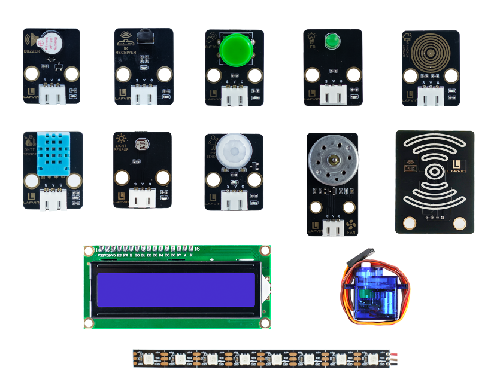
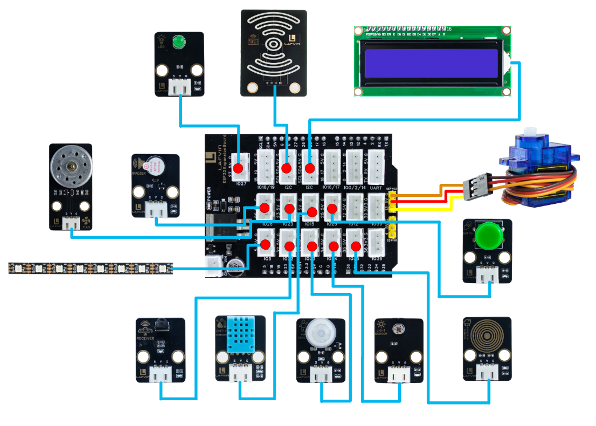
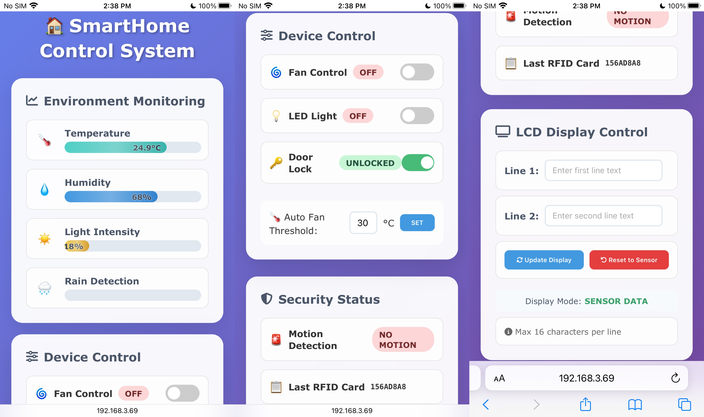

Course 11：Smart_Home
======================

- In this course, we will comprehensively utilize the various sensor modules we have learned previously to conduct a practical project. Sensor modules offer a wealth of combination possibilities, allowing for a variety of interesting application solutions. This course will focus on the theme of **Smart Home** ， designing and implementing a lively and engaging interactive experience.

----

Wiring
--------

 - DHT11 Sensor —— ESP32 IO15

 - Light Sensor —— ESP32 IO34

 - Rain Sensor —— ESP32 IO35

 - PIR Sensor —— ESP32 IO33

 - Button —— ESP32 IO25

 - IR Receiver —— ESP32 IO32

 - Buzzer —— ESP32 IO26

 - LED —— ESP32 IO27

 - Fan —— ESP32 IO23

 - Servo —— ESP32 IO13

 - RGB LED —— ESP32 IO5

 - RFID Module —— ESP32 I2C
 
 - LCD 1602 Screen —— ESP32 I2C

----

Example Code
------------

.. code-block:: cpp

   #include <WiFi.h>
   #include <WebServer.h>
   #include <DHT.h>
   #include <Wire.h>
   #include <LiquidCrystal_I2C.h>
   #include <MFRC522_I2C.h>
   #include <ESP32Servo.h>
   #include <Adafruit_NeoPixel.h>
   #include <IRremote.h>
   #include <Preferences.h>

   // ====== Module Pin Definitions ======
   #define DHTPIN 15
   #define DHTTYPE DHT11
   #define LIGHT_PIN 34
   #define RAIN_PIN 35
   #define PIR_PIN 33
   #define BUTTON_PIN 25
   #define IR_RECEIVE_PIN 32
   #define BUZZER_PIN 26
   #define LED_PIN 27
   #define FAN_PIN 23 
   #define SERVO_PIN 13
   #define RGB_PIN 5

   // I2C devices
   #define RC522_ADDR 0x28
   #define I2C_SDA 21
   #define I2C_SCL 22

   // ====== Module Objects ======
   DHT dht(DHTPIN, DHTTYPE);
   LiquidCrystal_I2C lcd(0x27, 16, 2);
   MFRC522_I2C mfrc522(RC522_ADDR, 0xFF);
   Servo doorServo;
   Adafruit_NeoPixel strip(8, RGB_PIN, NEO_GRB + NEO_KHZ800);
   WebServer server(80);
   Preferences preferences;

   // ====== WiFi Configuration ======
   const char* apSSID = "Smart_Home";
   const char* apPassword = NULL;

   String wifiSSID = "";
   String wifiPassword = "";
   bool isConfigMode = true;
   bool wifiConnected = false;

   // ====== System Variables ======
   // Sensor data
   float temperature = 0;
   float humidity = 0;
   int lightPercent = 0;
   int rainPercent = 0;
   bool motionDetected = false;
   bool humanDetectionEnabled = true;
   float tempThreshold = 30.0;

   // Device states
   bool ledState = false;
   bool fanState = false;
   bool fanManualMode = false; // Manual mode flag
   bool doorLocked = true;
   bool rgbEnabled = false;  // RGB switch state
   String currentEffect = "solid"; // Default solid color mode

   // RGB control
   int rgbR = 255;
   int rgbG = 0;
   int rgbB = 0;

   // Display
   String lcdLine1 = "Smart Home System";
   String lcdLine2 = "Initializing...";
   bool lcdCustomMode = false; // Flag for custom display mode

   // RFID
   String lastCardUID = "None";

   // Alarm
   bool alarmActive = false;

   // Timing
   unsigned long lastSensorRead = 0;
   unsigned long lastRGBUpdate = 0;
   unsigned long lastLCDUpdate = 0;
   const unsigned long SENSOR_INTERVAL = 2000;
   const unsigned long RGB_INTERVAL = 50;
   const unsigned long LCD_UPDATE_INTERVAL = 2000; // LCD data update interval

   // ====== IR Key Mapping ======
   String keyMap(uint32_t code) {
     switch(code) {
       case 0x16: return "1";
       case 0x19: return "2";
       case 0x0d: return "3";
       case 0x0c: return "4";
       case 0x18: return "5";
       case 0x5e: return "6";
       case 0x08: return "7";
       case 0x1c: return "8";
       case 0x5A: return "9";
       case 0x52: return "0";
       case 0x42: return "*";
       case 0x4A: return "#";
       case 0x46: return "UP";
       case 0x15: return "DOWN";
       case 0x40: return "OK";
       case 0x44: return "LEFT";
       case 0x43: return "RIGHT";
       default: return "";
     }
   }

   // ====== Device Control Functions ======
   void controlLED() {
     digitalWrite(LED_PIN, ledState ? HIGH : LOW);
     Serial.println("LED: " + String(ledState ? "ON" : "OFF"));
   }

   void controlFan() {
     // If in manual mode, maintain current state; otherwise auto control
     if (!fanManualMode) {
       if (temperature >= tempThreshold) {
         fanState = true;
       } else {
         fanState = false;
       }
     }
     digitalWrite(FAN_PIN, fanState ? HIGH : LOW);
   }

   void controlDoor() {
     doorServo.write(doorLocked ? 0 : 90);
     Serial.println("Door: " + String(doorLocked ? "LOCKED" : "UNLOCKED"));
   }

   void setRGBColor(int r, int g, int b) {
     for(int i=0; i<strip.numPixels(); i++) {
       strip.setPixelColor(i, strip.Color(r, g, b));
     }
     strip.show();
   }

   void updateRGBEffects() {
     if (!rgbEnabled) {
       // Clear LED strip when RGB is off
       for(int i=0; i<strip.numPixels(); i++) {
         strip.setPixelColor(i, 0);
       }
       strip.show();
       return;
     }
     
     unsigned long currentMillis = millis();
     static unsigned long effectStart = 0;
     static int effectState = 0;
     
     if (currentEffect == "solid") {
       // Solid color mode - use color from sliders
       setRGBColor(rgbR, rgbG, rgbB);
     }
     else if (currentEffect == "breath") {
       // Breathing effect
       int brightness = (exp(sin(currentMillis / 2000.0 * PI)) - 0.36787944) * 108.0;
       for(int i=0; i<strip.numPixels(); i++) {
         strip.setPixelColor(i, strip.Color(
           rgbR * brightness / 255,
           rgbG * brightness / 255, 
           rgbB * brightness / 255
         ));
       }
     }
     else if (currentEffect == "chase") {
       // Chase effect
       if (currentMillis - effectStart > 100) {
         effectStart = currentMillis;
         for(int i=0; i<strip.numPixels(); i++) {
           if ((i + effectState) % 3 == 0) {
             strip.setPixelColor(i, strip.Color(255, 255, 255));
           } else if ((i + effectState) % 3 == 1) {
             strip.setPixelColor(i, strip.Color(255, 0, 0));
           } else {
             strip.setPixelColor(i, strip.Color(0, 0, 255));
           }
         }
         effectState = (effectState + 1) % 3;
       }
     }
     else if (currentEffect == "fire") {
       // Fire effect
       for(int i=0; i<strip.numPixels(); i++) {
         int flicker = random(0, 50);
         int r = 255 - flicker;
         int g = random(100, 200) - flicker;
         int b = random(0, 50);
         strip.setPixelColor(i, strip.Color(r, g, b));
       }
     }
     
     strip.show();
   }

   void controlRGB() {
     // Update RGB state
     if (rgbEnabled) {
       Serial.println("RGB Enabled - Effect: " + currentEffect);
     } else {
       Serial.println("RGB Disabled");
       for(int i=0; i<strip.numPixels(); i++) {
         strip.setPixelColor(i, 0);
       }
       strip.show();
     }
   }

   void triggerAlarm() {
     if (humanDetectionEnabled && !alarmActive) {
       alarmActive = true;
       Serial.println("ALARM! Human detected!");
       
       // Buzzer alarm pattern
       for(int i=0; i<10; i++) {
         digitalWrite(BUZZER_PIN, HIGH);
         delay(100);
         digitalWrite(BUZZER_PIN, LOW);
         delay(100);
       }
       alarmActive = false;
     }
   }

   void stopAlarm() {
     alarmActive = false;
     digitalWrite(BUZZER_PIN, LOW);
     Serial.println("Alarm stopped");
   }

   void updateLCD() {
     lcd.clear();
     lcd.setCursor(0, 0);
     lcd.print(lcdLine1.substring(0, 16));
     lcd.setCursor(0, 1);
     lcd.print(lcdLine2.substring(0, 16));
   }

   void updateSensorDisplay() {
     // Update LCD display with sensor data in required format
     lcdLine1 = "TEMP:" + String(temperature, 1) + " HUMI:" + String(humidity, 0);
     lcdLine2 = "LIGHT:" + String(lightPercent) + " RAIN:" + String(rainPercent);
     updateLCD();
   }

   void readSensors() {
     temperature = dht.readTemperature();
     humidity = dht.readHumidity();
     
     if (isnan(temperature)) temperature = 0;
     if (isnan(humidity)) humidity = 0;

     // Light sensor
     int lightVal = analogRead(LIGHT_PIN);
     lightPercent = map(lightVal, 0, 4095, 0, 100);
     lightPercent = constrain(lightPercent, 0, 100);

     // Rain sensor - fix reverse display issue
     int rainVal = analogRead(RAIN_PIN);
     rainPercent = map(rainVal, 0, 4095, 0, 100);  // Fix: change to 0-100
     rainPercent = constrain(rainPercent, 0, 100);

     // Motion sensor
     bool currentMotion = digitalRead(PIR_PIN);
     if (currentMotion && !motionDetected) {
       motionDetected = true;
       if (humanDetectionEnabled) {
         triggerAlarm();
       }
     } else if (!currentMotion) {
       motionDetected = false;
     }
   }

   void checkButton() {
     static bool lastButtonState = HIGH;
     static unsigned long lastPressTime = 0;
     bool currentState = digitalRead(BUTTON_PIN);
     
     if (currentState == LOW && lastButtonState == HIGH && millis() - lastPressTime > 300) {
       // Button pressed - toggle LED
       ledState = !ledState;
       controlLED();
       lastPressTime = millis();
     }
     lastButtonState = currentState;
   }

   void checkRFID() {
     if (mfrc522.PICC_IsNewCardPresent() && mfrc522.PICC_ReadCardSerial()) {
       lastCardUID = "";
       for (byte i = 0; i < mfrc522.uid.size; i++) {
         if (mfrc522.uid.uidByte[i] < 0x10) lastCardUID += "0";
         lastCardUID += String(mfrc522.uid.uidByte[i], HEX);
       }
       lastCardUID.toUpperCase();
       
       // Toggle door lock with any valid card
       doorLocked = !doorLocked;
       controlDoor();
       Serial.println("RFID Card: " + lastCardUID + " - Door: " + String(doorLocked ? "LOCKED" : "UNLOCKED"));
       
       mfrc522.PICC_HaltA();
       mfrc522.PCD_StopCrypto1();
     }
   }

   void checkIRRemote() {
     if (IrReceiver.decode()) {
       String key = keyMap(IrReceiver.decodedIRData.command);
       
       if (key == "OK") {
         // Toggle RGB on/off
         rgbEnabled = !rgbEnabled;
         controlRGB();
         Serial.println("IR: RGB " + String(rgbEnabled ? "ON" : "OFF"));
       }
       else if (key == "1" && rgbEnabled) {
         currentEffect = "solid";
         Serial.println("IR: RGB Effect - Solid");
       }
       else if (key == "2" && rgbEnabled) {
         currentEffect = "breath";
         Serial.println("IR: RGB Effect - Breath");
       }
       else if (key == "3" && rgbEnabled) {
         currentEffect = "chase";
         Serial.println("IR: RGB Effect - Chase");
       }
       else if (key == "4" && rgbEnabled) {
         currentEffect = "fire";
         Serial.println("IR: RGB Effect - Fire");
       }
       else if (key == "*") {
         humanDetectionEnabled = true;
         Serial.println("Human detection ENABLED");
       }
       else if (key == "#") {
         humanDetectionEnabled = false;
         stopAlarm();
         Serial.println("Human detection DISABLED");
       }
       
       if (key != "") {
         Serial.println("IR Key: " + key);
       }
       
       IrReceiver.resume();
     }
   }

   // ====== Web Server Functions ======
   String configHTMLPage() {
     return R"rawliteral(
   <!DOCTYPE html>
   <html lang="en">
   <head>
   <meta charset="UTF-8">
   <meta name="viewport" content="width=device-width, initial-scale=1.0">
   <title>ESP32 WiFi Configuration</title>
   
   </head>
   <body>
     

       <h1>WiFi Configuration</h1>
       <form action="/configure" method="POST">
         <input type="text" name="ssid" placeholder="WiFi SSID" required>
         <input type="password" name="password" placeholder="WiFi Password" required>
         <button type="submit">Connect</button>
       </form>
     

   </body>
   </html>
   )rawliteral";
   }

   String controlHTMLPage() {
     String html = R"rawliteral(
   <!DOCTYPE html>
   <html lang="en">
   <head>
   <meta charset="UTF-8">
   <meta name="viewport" content="width=device-width, initial-scale=1.0">
   <title>SmartHome Control System</title>
   
   <link rel="stylesheet" href="https://cdnjs.cloudflare.com/ajax/libs/font-awesome/6.4.0/css/all.min.css">
   </head>
   <body>
   

     

       <h1>🏠 SmartHome Control System</h1>
     

     

       <!-- Environment monitoring card -->
       

         <h3><i class="fas fa-chart-line"></i> Environment Monitoring</h3>
         

           

             
🌡️

             

               
Temperature

               

                 

                   0°C
                 

               

             

           

           
           

             
💧

             

               
Humidity

               

                 

                   0%
                 

               

             

           

           
           

             
☀️

             

               
Light Intensity

               

                 

                   0%
                 

               

             

           

           
           

             
🌧️

             

               
Rain Detection

               

                 

                   0%
                 

               

             

           

         

       

       <!-- Device control card -->
       

         <h3><i class="fas fa-sliders-h"></i> Device Control</h3>
         

           

             

               🌀
               Fan Control
               OFF
             

             <label class="toggle-switch">
               <input type="checkbox" id="fanToggle" onchange="toggleDevice('fan')">
               
             </label>
           

           
           

             

               💡
               LED Light
               OFF
             

             <label class="toggle-switch">
               <input type="checkbox" id="ledToggle" onchange="toggleDevice('led')">
               
             </label>
           

           
           

             

               🔑
               Door Lock
               LOCKED
             

             <label class="toggle-switch">
               <input type="checkbox" id="doorToggle" onchange="toggleDevice('door')">
               
             </label>
           

           
           

             🌡️ Auto Fan Threshold:
             <input type="number" id="tempThreshold" class="threshold-input" min="10" max="40" value="30">
             °C
             <button class="threshold-btn" onclick="setTemperatureThreshold()">SET</button>
           

         

       

       <!-- Security status card -->
       

         <h3><i class="fas fa-shield-alt"></i> Security Status</h3>
         

           

             

               🚨
               Motion Detection
               NO MOTION
             

           

           
           

             

               📋
               Last RFID Card
               No Record
             

           

         

       

       <!-- LCD display control card -->
       

         <h3><i class="fas fa-tv"></i> LCD Display Control</h3>
         

           

             

               Line 1:
               <input type="text" id="lcdLine1" class="lcd-input" placeholder="Enter first line text" maxlength="16">
             

           

           
           

             

               Line 2:
               <input type="text" id="lcdLine2" class="lcd-input" placeholder="Enter second line text" maxlength="16">
             

           

           
           

             <button class="lcd-btn" onclick="updateLCD()">
               <i class="fas fa-sync-alt"></i> Update Display
             </button>
             <button class="lcd-btn reset" onclick="resetLCD()">
               <i class="fas fa-undo"></i> Reset to Sensor
             </button>
           

           
           

             

               Display Mode: SENSOR DATA
             

           

           
           

             

               <i class="fas fa-info-circle"></i> Max 16 characters per line
             

           

         

       

     

   

   
   </body>
   </html>
   )rawliteral";
     return html;
   }

   void handleRoot() {
     if (isConfigMode) {
       server.send(200, "text/html", configHTMLPage());
     } else {
       server.send(200, "text/html", controlHTMLPage());
     }
   }

   void handleData() {
     String json = "{";
     json += "\"ledState\":" + String(ledState ? "true" : "false") + ",";
     json += "\"fanState\":" + String(fanState ? "true" : "false") + ",";
     json += "\"temperature\":" + String(temperature, 1) + ",";
     json += "\"humidity\":" + String(humidity, 0) + ",";
     json += "\"lightPercent\":" + String(lightPercent) + ",";
     json += "\"rainPercent\":" + String(rainPercent) + ",";
     json += "\"doorLocked\":" + String(doorLocked ? "true" : "false") + ",";
     json += "\"motionDetected\":" + String(motionDetected ? "true" : "false") + ",";
     json += "\"humanDetectionEnabled\":" + String(humanDetectionEnabled ? "true" : "false") + ",";
     json += "\"cardUID\":\"" + lastCardUID + "\",";
     json += "\"rgbEnabled\":" + String(rgbEnabled ? "true" : "false") + ",";
     json += "\"rgbR\":" + String(rgbR) + ",";
     json += "\"rgbG\":" + String(rgbG) + ",";
     json += "\"rgbB\":" + String(rgbB) + ",";
     json += "\"lcdLine1\":\"" + lcdLine1 + "\",";
     json += "\"lcdLine2\":\"" + lcdLine2 + "\",";
     json += "\"lcdCustomMode\":" + String(lcdCustomMode ? "true" : "false") + ",";
     json += "\"currentEffect\":\"" + currentEffect + "\"";
     json += "}";
     server.send(200, "application/json", json);
   }

   void handleControl() {
     if (server.hasArg("device")) {
       String device = server.arg("device");
       
       if (device == "led") {
         ledState = !ledState;
         controlLED();
       }
       else if (device == "fan") {
         // Set to manual mode when controlling fan from web
         fanManualMode = true;
         fanState = !fanState;
         digitalWrite(FAN_PIN, fanState ? HIGH : LOW);
         Serial.println("Fan manual mode: " + String(fanState ? "ON" : "OFF"));
       }
       else if (device == "door") {
         doorLocked = !doorLocked;
         controlDoor();
       }
       else if (device == "rgb") {
         if (server.hasArg("enabled")) {
           rgbEnabled = server.arg("enabled") == "true";
           controlRGB();
         }
       }
       else if (device == "rgbColor") {
         if (server.hasArg("r") && server.hasArg("g") && server.hasArg("b")) {
           rgbR = server.arg("r").toInt();
           rgbG = server.arg("g").toInt();
           rgbB = server.arg("b").toInt();
           currentEffect = "solid"; // Switch to solid color mode
           if (!rgbEnabled) {
             rgbEnabled = true; // Automatically enable RGB
           }
           controlRGB();
         }
       }
       else if (device == "rgbEffect") {
         if (server.hasArg("effect")) {
           currentEffect = server.arg("effect");
           if (!rgbEnabled) {
             rgbEnabled = true; // Automatically enable RGB
           }
           controlRGB();
         }
       }
       else if (device == "tempThreshold") {
         if (server.hasArg("value")) {
           tempThreshold = server.arg("value").toFloat();
           fanManualMode = false; // Switch back to auto mode when setting threshold
           Serial.println("Temperature threshold set to: " + String(tempThreshold) + ", Auto mode enabled");
         }
       }
       else if (device == "lcd") {
         if (server.hasArg("reset") && server.arg("reset") == "true") {
           // Reset to sensor data display mode
           lcdCustomMode = false;
           updateSensorDisplay();
           Serial.println("LCD reset to sensor display mode");
         } else {
           // Custom display mode
           if (server.hasArg("line1") || server.hasArg("line2")) {
             lcdCustomMode = true;
             if (server.hasArg("line1")) lcdLine1 = server.arg("line1");
             if (server.hasArg("line2")) lcdLine2 = server.arg("line2");
             updateLCD();
             Serial.println("LCD custom mode: Line1='" + lcdLine1 + "', Line2='" + lcdLine2 + "'");
           }
         }
       }
     }
     server.send(200, "text/plain", "OK");
   }

   void handleConfigure() {
     wifiSSID = server.arg("ssid");
     wifiPassword = server.arg("password");
     preferences.putString("ssid", wifiSSID);
     preferences.putString("password", wifiPassword);
     server.send(200, "text/html", "<html><body><h2>Connecting...</h2></body></html>");
     delay(2000);
     ESP.restart();
   }

   bool connectToWiFi() {
     if (wifiSSID == "") return false;
     WiFi.begin(wifiSSID.c_str(), wifiPassword.c_str());
     for(int i=0; i<20 && WiFi.status() != WL_CONNECTED; i++) { delay(500); Serial.print("."); }
     if (WiFi.status() == WL_CONNECTED) {
       Serial.println("\nWiFi connected! IP: " + WiFi.localIP().toString());
       return true;
     }
     return false;
   }

   void setupAccessPoint() {
     WiFi.softAP(apSSID, apPassword);
     Serial.println("AP Started: " + String(apSSID));
     Serial.println("IP: " + WiFi.softAPIP().toString());
   }

   void setup() {
     Serial.begin(115200);
     
     // Initialize modules
     Wire.begin(I2C_SDA, I2C_SCL);
     dht.begin();
     lcd.init();
     lcd.backlight();
     mfrc522.PCD_Init();
     doorServo.attach(SERVO_PIN);
     strip.begin();
     strip.setBrightness(100);
     IrReceiver.begin(IR_RECEIVE_PIN);
     
     // Pin modes
     pinMode(BUTTON_PIN, INPUT_PULLUP);
     pinMode(PIR_PIN, INPUT);
     pinMode(LIGHT_PIN, INPUT);
     pinMode(RAIN_PIN, INPUT);
     pinMode(BUZZER_PIN, OUTPUT);
     pinMode(LED_PIN, OUTPUT);
     pinMode(FAN_PIN, OUTPUT);
     
     // Initialize devices
     controlLED();
     controlDoor();
     controlRGB();
     digitalWrite(BUZZER_PIN, LOW);
     
     // WiFi setup
     preferences.begin("wifi-config", false);
     wifiSSID = preferences.getString("ssid", "");
     wifiPassword = preferences.getString("password", "");
     
     if (wifiSSID != "" && connectToWiFi()) {
       isConfigMode = false;
       wifiConnected = true;
       Serial.println("Mode: Station");
       
       // Show IP on LCD temporarily
       lcdLine1 = "WiFi Connected";
       lcdLine2 = WiFi.localIP().toString();
       updateLCD();
       delay(3000); // Show IP for 3 seconds
     } else {
       setupAccessPoint();
       Serial.println("Mode: Access Point");
       
       // Show AP info on LCD temporarily
       lcdLine1 = "AP: " + String(apSSID);
       lcdLine2 = WiFi.softAPIP().toString();
       updateLCD();
       delay(3000); // Show AP info for 3 seconds
     }
     
     // Web server routes
     server.on("/", handleRoot);
     server.on("/data", handleData);
     server.on("/control", handleControl);
     server.on("/configure", HTTP_POST, handleConfigure);
     server.begin();
     
     Serial.println("SmartHome Control System Ready!");
   }

   void loop() {
     server.handleClient();
     
     unsigned long currentMillis = millis();
     
     // Read sensors periodically
     if (currentMillis - lastSensorRead >= SENSOR_INTERVAL) {
       readSensors();
       controlFan(); // Auto control fan based on temperature
       lastSensorRead = currentMillis;
     }
     
     // Update LCD display with sensor data if not in custom mode
     if (currentMillis - lastLCDUpdate >= LCD_UPDATE_INTERVAL) {
       if (!lcdCustomMode) {
         updateSensorDisplay();
       }
       lastLCDUpdate = currentMillis;
     }
     
     // Update RGB effects
     if (currentMillis - lastRGBUpdate >= RGB_INTERVAL) {
       updateRGBEffects();
       lastRGBUpdate = currentMillis;
     }
     
     // Check inputs
     checkButton();
     checkRFID();
     checkIRRemote();
   }

----

**Code burning options**

1. You can directly copy the code provided above into the Arduino IDE for burning.

2. Find the **11.SmartHome.ino** file in the provided folder, download it, open it with the **Arduino IDE**, and burn the program to the ESP32 development board.

3. Find the **11.SmartHome.bin** file in the provided folder, download it and use **Flash Download Tool** to flash the program to the ESP32 development board. 

----

Effects Demonstration
---------------------

📊 **Visualized Environmental Monitoring**
 - Real-time display of temperature, humidity, light intensity, and rainfall data, providing a clear overview of environmental conditions.

🎛️ **Intelligent Equipment Control**
 - Remote control of fans, LED lights, and door lock status.
 - Supports customizable temperature thresholds for automatic fan start/stop.

🚨 **Security Alarm System**
 - Human movement detection automatically triggers a buzzer alarm.
 - Infrared remote control with the # key to deactivate the alarm.

🔐 **Intelligent Access Control**
 - RFID card swipe unlocks doors; the system automatically records the card number.

📟 **Multifunctional Display Screen**
 - The LCD1602 displays environmental sensor data in a default loop; user-defined display content is also supported.

🌈 **Vibrant Lighting Effects**
 - RGB light strip supports infrared remote control
 - OK key: Turn lights on/off
 - Number keys 1-4: Switch between four vibrant dynamic modes（solid color/breathing/chasing/flame）.

----
