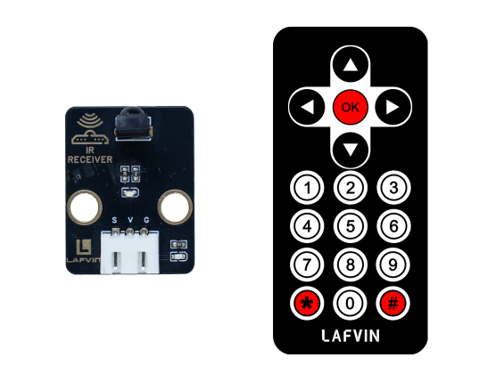
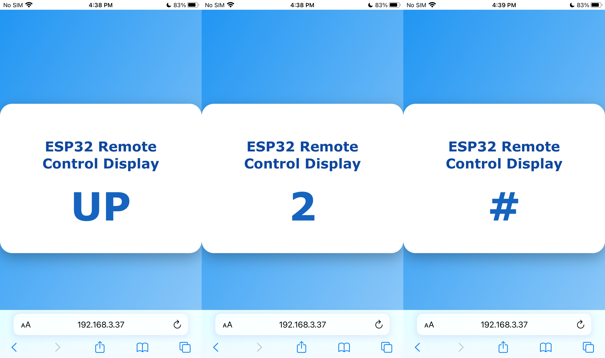

Course 2：IR_Display
====================

----

Learning Objectives
-------------------

 - Understand the principles of infrared remote control signal reception and decoding（NEC protocol）.

 - Implement an interactive effect that displays the infrared button values ​​in real time on a webpage.

----

Required Component
------------------

 - IR Receiver Module、Infrared Remote Control

----

Working Principle
-----------------

 - When a button on the remote control is pressed, the infrared LED emits 38 kHz modulated infrared light, carrying a code representing the button press （such as the NEC protocol）. 
 - The receiver is sensitive to 38 kHz infrared light and converts the optical signal into an electrical signal. The MCU （such as ESP32） samples the pulse signal and deciphers the button press value.

----

Wiring
--------

 - IR Receiver Module —— ESP32 IO15

.. image:: _static/COURSE/6.IR.png
  :align: center

----

Example Code
------------

.. code-block:: cpp

   #include <WiFi.h>
   #include <WebServer.h>
   #include <IRremote.h>
   #include <Preferences.h>

   // ===== Hardware Definitions =====
   #define IR_RECEIVE_PIN 15
   String lastKey = "";      // Save last key press
   String currentKey = "";

   // ===== WiFi Configuration =====
   const char* apSSID = "IR_Display";  // Access Point SSID (no password)
   const char* apPassword = NULL;     // No password

   String wifiSSID = "";        // Store target WiFi SSID
   String wifiPassword = "";    // Store target WiFi password

   bool isConfigMode = true;    // Configuration mode flag
   bool wifiConnected = false;  // WiFi connection status

   // ===== Web Server =====
   WebServer server(80);

   // ===== Preferences for storing WiFi credentials =====
   Preferences preferences;

   // ===== Key Mapping =====
   String keyMap(uint32_t code) {
     switch(code) {
       case 0x16: return "1";
       case 0x19: return "2";
       case 0x0d: return "3";
       case 0x0c: return "4";
       case 0x18: return "5";
       case 0x5e: return "6";
       case 0x08: return "7";
       case 0x1c: return "8";
       case 0x5A: return "9";
       case 0x52: return "0";
       case 0x42: return "*";
       case 0x4A: return "#";
       case 0x46: return "UP";
       case 0x15: return "DOWN";
       case 0x40: return "OK";
       case 0x44: return "LEFT";
       case 0x43: return "RIGHT";
       default: return "";
     }
   }

   // ===== HTML Configuration Page =====
   String configHTMLPage() {
     String page = R"rawliteral(
   <!DOCTYPE html>
   <html lang="en">
   <head>
   <meta charset="UTF-8">
   <meta name="viewport" content="width=device-width, initial-scale=1.0">
   <title>ESP32 WiFi Configuration</title>
   
   </head>
   <body>
     

       <h1>WiFi Configuration</h1>
       <form action='/configure' method='POST'>
         <input type='text' name='ssid' placeholder='WiFi SSID' required>
         <input type='password' name='password' placeholder='WiFi Password' required>
         <button type='submit'>Connect</button>
       </form>
     

   </body>
   </html>
   )rawliteral";
     return page;
   }

   // ===== HTML Control Page =====
   String controlHTMLPage() {
     String page = R"rawliteral(
   <!DOCTYPE html>
   <html lang="en">
   <head>
   <meta charset="UTF-8">
   <meta name="viewport" content="width=device-width, initial-scale=1.0">
   <title>ESP32 Remote Control Display</title>
   
   </head>
   <body>
     

       <h1>ESP32 Remote Control Display</h1>
       
-

     

   
   </body>
   </html>
   )rawliteral";
     return page;
   }

   // ===== Route Handlers =====
   void handleRoot() {
     if (isConfigMode) {
       server.send(200, "text/html", configHTMLPage());
     } else {
       server.send(200, "text/html", controlHTMLPage());
     }
   }

   void handleKey() {
     server.send(200, "text/plain", currentKey);
   }

   void handleConfigure() {
     wifiSSID = server.arg("ssid");
     wifiPassword = server.arg("password");

     preferences.putString("ssid", wifiSSID);
     preferences.putString("password", wifiPassword);

     server.send(200, "text/html",
                 "<html><body><h2>Connecting to WiFi...</h2>"
                 "
SSID: " + wifiSSID + "
"
                 "
Device will restart and attempt connection.
"
                 ""
                 "</body></html>");

     delay(2000);
     ESP.restart();
   }

   // ===== Connect to WiFi =====
   bool connectToWiFi() {
     if (wifiSSID == "") return false;

     Serial.println("Attempting to connect to WiFi: " + wifiSSID);
     WiFi.begin(wifiSSID.c_str(), wifiPassword.c_str());

     int attempts = 0;
     while (WiFi.status() != WL_CONNECTED && attempts < 20) {
       delay(500);
       Serial.print(".");
       attempts++;
     }

     if (WiFi.status() == WL_CONNECTED) {
       Serial.println("\nWiFi connected successfully!");
       Serial.println("IP address: " + WiFi.localIP().toString());
       return true;
     } else {
       Serial.println("\nFailed to connect to WiFi");
       return false;
     }
   }

   // ===== Setup Access Point =====
   void setupAccessPoint() {
     Serial.println("Setting up Access Point...");
     WiFi.softAP(apSSID, apPassword);
     Serial.println("Access Point started");
     Serial.println("SSID: " + String(apSSID));
     Serial.println("Password: None (Open Network)");
     Serial.println("IP address: " + WiFi.softAPIP().toString());
   }

   // ===== Setup =====
   void setup() {
     Serial.begin(115200);
     Serial.println("ESP32 IR Remote Web Display");

     preferences.begin("wifi-config", false);

     wifiSSID = preferences.getString("ssid", "");
     wifiPassword = preferences.getString("password", "");

     Serial.println("=== ESP32 WiFi Configuration ===");

     if (wifiSSID != "" && connectToWiFi()) {
       isConfigMode = false;
       wifiConnected = true;
       Serial.println("Mode: Station (Connected to WiFi)");
     } else {
       isConfigMode = true;
       wifiConnected = false;
       setupAccessPoint();
       Serial.println("Mode: Access Point (Configuration)");
     }

     IrReceiver.begin(IR_RECEIVE_PIN, ENABLE_LED_FEEDBACK);
     Serial.println("IR Receiver initialized");

     server.on("/", handleRoot);
     server.on("/key", handleKey);
     server.on("/configure", HTTP_POST, handleConfigure);

     server.begin();
     Serial.println("Web server started.");
   }

   // ===== Main Loop =====
   void loop() {
     server.handleClient();

     if (IrReceiver.decode()) {
       uint32_t code = IrReceiver.decodedIRData.command;
       String key = keyMap(code);

       if (key != "" && key != lastKey) {
         currentKey = key;
         lastKey = key;
         Serial.print("Key pressed: ");
         Serial.println(currentKey);
       }

       IrReceiver.resume();
     }
   }

----

**Code burning options**

1. You can directly copy the code provided above into the Arduino IDE for burning.

2. Find the **2.IR_Display.ino** file in the provided folder, download it, open it with the **Arduino IDE**, and burn the program to the ESP32 development board.

3. Find the **2.IR_Display.bin** file in the provided folder, download it and use **Flash Download Tool** to flash the program to the ESP32 development board. 

----

Effects Demonstration
---------------------

1. When a button on the remote control is pressed, the ESP32 receives the infrared signal and parses the corresponding code. The web interface will then display the name of the button, enabling real-time interaction between the remote control and the web interface.

2. Infrared key mapping function：

.. code-block:: cpp
 
 String keyMap(uint32_t code) {
  switch(code) {
    case 0x16: return "1";
    case 0x19: return "2";
    case 0x0d: return "3";
    case 0x0c: return "4";
    case 0x18: return "5";
    case 0x5e: return "6";
    case 0x08: return "7";
    case 0x1c: return "8";
    case 0x5A: return "9";
    case 0x52: return "0";
    case 0x46: return "UP";
    case 0x15: return "DOWN";
    case 0x44: return "LEFT";
    case 0x43: return "RIGHT";
    case 0x40: return "OK";
    default: return "";
   }
 }

----
