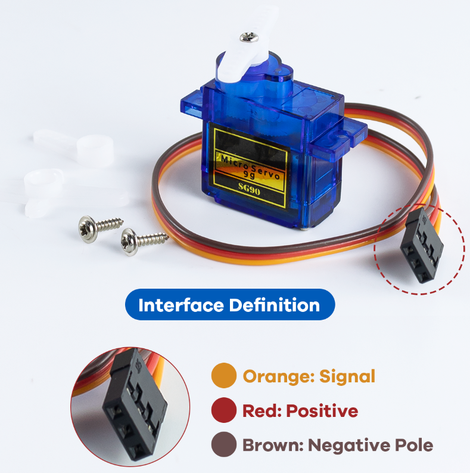
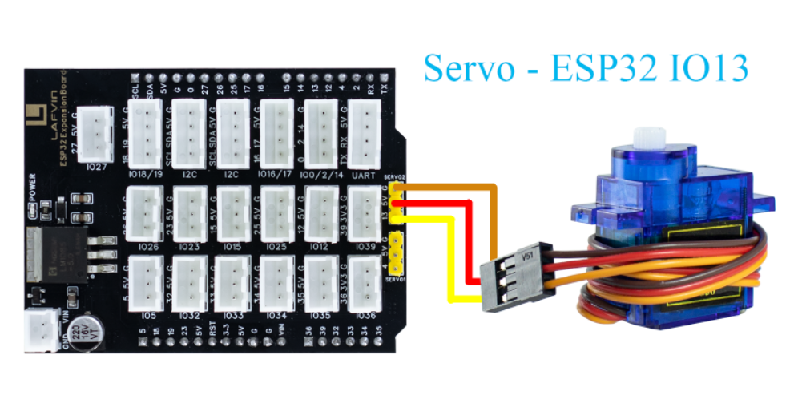
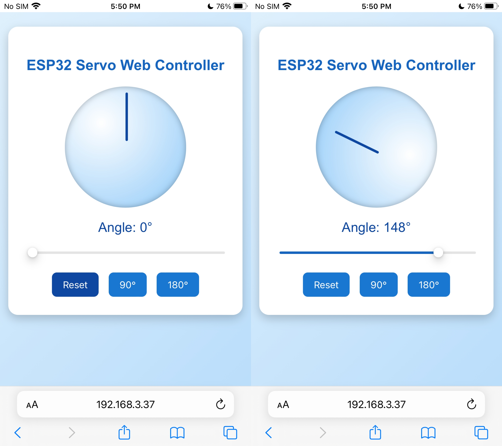

Course 3：Servo_Control
=======================

----

Learning Objectives
-------------------

 - By controlling the rotation of the SG90 servo, one can master the basic working principle of servos and the PWM control method, and achieve precise control of the servo's rotation angle.

----

Required Component
------------------

 - SG90 Servo

----

Working Principle
-----------------

 - The SG90 servo receives PWM pulse width signals from the controller and uses internal potentiometer feedback to achieve closed-loop control of the motor, thereby precisely adjusting and maintaining a specified angle.
 - The ESP32 sends a PWM signal with a period of approximately 20ms（50Hz）to the servo motor.The pulse width（high-level time）determines the servo motor's rotation angle: 0.5ms - 0 degrees, 1.5ms - 90 degrees, 2.5ms - 180 degrees.

----

Wiring
--------

 - SG90 Servo —— ESP32 IO13

----

Example Code
------------

.. code-block:: cpp
    :linenos:

    #include <WiFi.h>
    #include <WebServer.h>
    #include <ESP32Servo.h>
    #include <Preferences.h>

    // ===== Servo Configuration =====
    #define SERVO_PIN 13
    Servo servo;
    int currentAngle = 0;  // Initial angle (power-on reset)

    // ===== WiFi Configuration =====
    const char* apSSID = "Servo_Control";  // Access Point SSID 
    const char* apPassword = NULL;         // No password

    String wifiSSID = "";        // Store target WiFi SSID
    String wifiPassword = "";    // Store target WiFi password

    bool isConfigMode = true;    // Configuration mode flag
    bool wifiConnected = false;  // WiFi connection status

    // ===== Web Server =====
    WebServer server(80);

    // ===== Preferences for storing WiFi credentials =====
    Preferences preferences;

    // ===== HTML Configuration Page =====
    String configHTMLPage() {
      String page = R"rawliteral(
    <!DOCTYPE html>
    <html lang="en">
    <head>
    <meta charset="UTF-8">
    <meta name="viewport" content="width=device-width, initial-scale=1.0">
    <title>ESP32 WiFi Configuration</title>
    
    </head>
    <body>
      

        <h2>WiFi Configuration</h2>
        <form action='/configure' method='POST'>
          <input type='text' name='ssid' placeholder='WiFi SSID' required>
          <input type='password' name='password' placeholder='WiFi Password' required>
          <button type='submit'>Connect</button>
        </form>
      

    </body>
    </html>
    )rawliteral";
      return page;
    }

    // ===== HTML Control Page =====
    String controlHTMLPage(int angle) {
      String page = R"rawliteral(
    <!DOCTYPE html>
    <html lang="en">
    <head>
    <meta charset="UTF-8">
    <meta name="viewport" content="width=device-width, initial-scale=1.0">
    <title>ESP32 Servo Controller</title>
    
    </head>
    <body>
      

        <h2>ESP32 Servo Web Controller</h2>
        

          

            

          

        

        
Angle: 0°

        <input type="range" id="angleSlider" min="0" max="180" value="0">
        

          <button onclick="setAngle(0)">Reset</button>
          <button onclick="setAngle(90)">90°</button>
          <button onclick="setAngle(180)">180°</button>
        

      

    
    </body>
    </html>
    )rawliteral";
      return page;
    }

    // ===== Route Handlers =====
    void handleRoot() {
      if (isConfigMode) {
        server.send(200, "text/html", configHTMLPage());
      } else {
        server.send(200, "text/html", controlHTMLPage(currentAngle));
      }
    }

    void handleSet() {
      if (server.hasArg("angle")) {
        int newAngle = server.arg("angle").toInt();
        newAngle = constrain(newAngle, 0, 180);
        currentAngle = newAngle;
        servo.write(currentAngle);
        Serial.printf("Servo angle set to %d°\n", currentAngle);
      }
      server.send(200, "text/plain", "OK");
    }

    void handleConfigure() {
      wifiSSID = server.arg("ssid");
      wifiPassword = server.arg("password");
      preferences.putString("ssid", wifiSSID);
      preferences.putString("password", wifiPassword);
      server.send(200, "text/html", "<html><body><h2>Connecting to WiFi...</h2>"
                  "
SSID: " + wifiSSID + "
"
                  "
Device will restart and attempt connection.
"
                  ""
                  "</body></html>");
      delay(2000);
      ESP.restart();
    }

    bool connectToWiFi() {
      if (wifiSSID == "") return false;
      Serial.println("Attempting to connect to WiFi: " + wifiSSID);
      WiFi.begin(wifiSSID.c_str(), wifiPassword.c_str());
      int attempts = 0;
      while (WiFi.status() != WL_CONNECTED && attempts < 20) {
        delay(500);
        Serial.print(".");
        attempts++;
      }
      if (WiFi.status() == WL_CONNECTED) {
        Serial.println("\nWiFi connected successfully!");
        Serial.println("IP address: " + WiFi.localIP().toString());
        return true;
      } else {
        Serial.println("\nFailed to connect to WiFi");
        return false;
      }
    }

    void setupAccessPoint() {
      Serial.println("Setting up Access Point...");
      WiFi.softAP(apSSID, apPassword);
      Serial.println("Access Point started");
      Serial.println("SSID: " + String(apSSID));
      Serial.println("Password: None (Open Network)");
      Serial.println("IP address: " + WiFi.softAPIP().toString());
    }

    void setup() {
      Serial.begin(115200);
      servo.attach(SERVO_PIN);
      currentAngle = 0;
      servo.write(currentAngle);
      Serial.println("Servo reset to 0°");

      preferences.begin("wifi-config", false);
      wifiSSID = preferences.getString("ssid", "");
      wifiPassword = preferences.getString("password", "");
      Serial.println("=== ESP32 Servo Controller ===");

      if (wifiSSID != "" && connectToWiFi()) {
        isConfigMode = false;
        wifiConnected = true;
        Serial.println("Mode: Station (Connected to WiFi)");
      } else {
        isConfigMode = true;
        wifiConnected = false;
        setupAccessPoint();
        Serial.println("Mode: Access Point (Configuration)");
      }

      server.on("/", handleRoot);
      server.on("/set", handleSet);
      server.on("/configure", HTTP_POST, handleConfigure);
      server.begin();
      Serial.println("Web server started.");
    }

    void loop() {
      server.handleClient();
    }

----

**Code burning options**

1. You can directly copy the code provided above into the Arduino IDE for burning.

2. Find the **3.Servo_Control.ino** file in the provided folder, download it, open it with the **Arduino IDE**, and burn the program to the ESP32 development board.

3. Find the **3.Servo_Control.bin** file in the provided folder, download it and use **Flash Download Tool** to flash the program to the ESP32 development board. 

----

Effects Demonstration
---------------------

1. After opening the web control interface, drag the slider to control the servo's rotation angle.

2. Click the three preset angle buttons at the bottom, and the servo will automatically rotate to the corresponding angle position.

----
