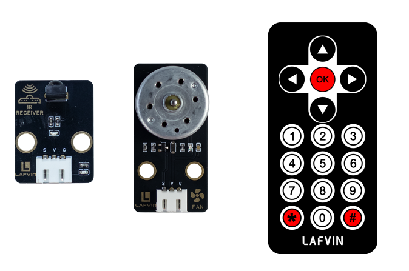
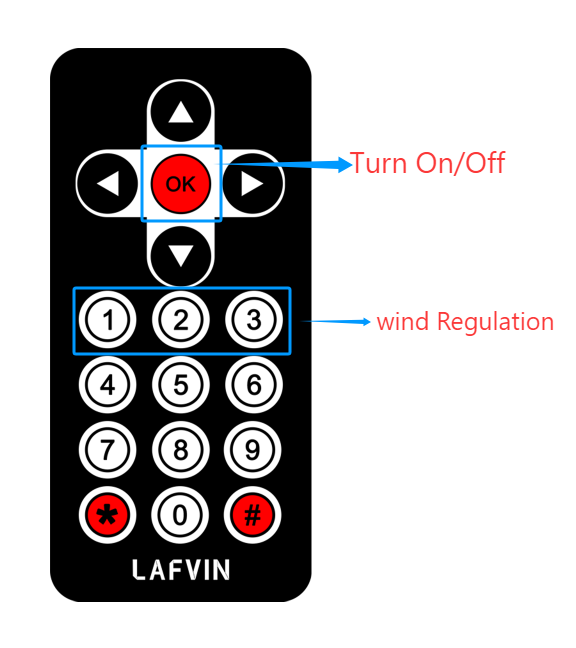
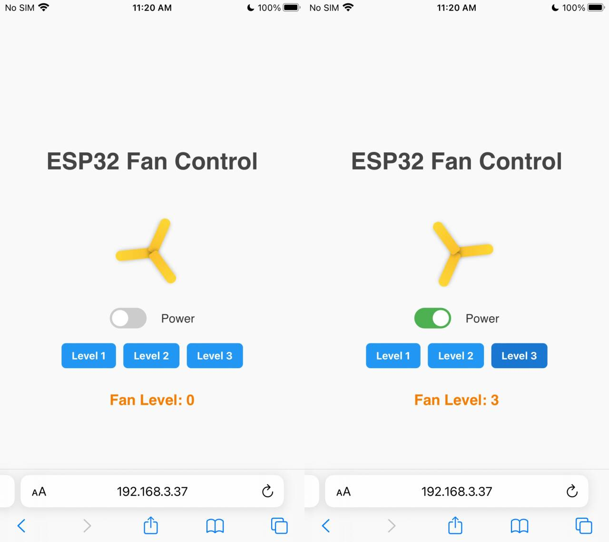

Course 4：Fan_Control
=======================

----

Learning Objectives
-------------------

  - Master the working principle and signal decoding method of infrared remote control modules; 
  - Understand the practical application of PWM（Pulse Width Modulation）in fan speed control; 
  - Learn multi-input control logic design（synchronization of infrared remote control and web page control signals）.

----

Required Component
------------------

 - Motor Fan Module、IR Receiver Module

----

Working Principle
-----------------

 - When voltage is applied across the motor, current flows through the stator coils, generating a magnetic field. This magnetic field, in turn, creates an electromagnetic torque between the rotor's permanent magnets, driving the rotor to rotate. The rotor's rotation then drives the fan blades, creating airflow.
 - The fan generates airflow by rotating a DC motor under the action of electromagnetic force. The motor speed can be controlled by adjusting the duty cycle of the PWM signal, thereby achieving wind speed regulation.

----

Wiring
--------

 - Motor Fan Module —— ESP32 IO27
 - IR Receiver Module —— ESP32 IO15

.. image:: _static/COURSE/11.FAN.png
  :align: center

----

Example Code
------------

.. code-block:: cpp

   #include <WiFi.h>
   #include <WebServer.h>
   #include <IRremote.h>
   #include <Preferences.h>

   // ===== Pin Definitions =====
   #define IR_RECEIVE_PIN 15
   #define FAN_PIN 27

   bool fanOn = false;
   int fanLevel = 0;
   String lastKey = "";
   unsigned long lastKeyTime = 0; // Debounce timer

   // ===== WiFi Configuration =====
   const char* apSSID = "Fan_Control";  // Access Point SSID (no password)
   const char* apPassword = NULL;       // No password

   String wifiSSID = "";        // Store target WiFi SSID
   String wifiPassword = "";    // Store target WiFi password

   bool isConfigMode = true;    // Configuration mode flag
   bool wifiConnected = false;  // WiFi connection status

   // ===== Web Server =====
   WebServer server(80);

   // ===== Preferences for storing WiFi credentials =====
   Preferences preferences;

   // ===== Key Mapping =====
   String keyMap(uint32_t code) {
     switch(code) {
       case 0x16: return "1";
       case 0x19: return "2";
       case 0x0d: return "3";
       case 0x40: return "OK";
       default: return "";
     }
   }

   // ===== Fan Control Function =====
   void setFanLevel(int level, bool on = true){
     fanOn = on;
     fanLevel = (fanOn) ? level : 0;
     int duty = 0;
     if(fanOn){
       switch(fanLevel){
         case 1: duty = 85; break;
         case 2: duty = 170; break;
         case 3: duty = 255; break;
         default: duty = 0;
       }
     }
     analogWrite(FAN_PIN, duty);  // Use older ESP32 core analogWrite
   }

   // ===== HTML Configuration Page =====
   String configHTMLPage() {
     String page = R"rawliteral(
   <!DOCTYPE html>
   <html lang="en">
   <head>
   <meta charset="UTF-8">
   <meta name="viewport" content="width=device-width, initial-scale=1.0">
   <title>ESP32 WiFi Configuration</title>
   
   </head>
   <body>
   

     <h1>WiFi Configuration</h1>
     <form action='/configure' method='POST'>
       <input type='text' name='ssid' placeholder='WiFi SSID' required>
       <input type='password' name='password' placeholder='WiFi Password' required>
       <button type='submit'>Connect</button>
     </form>
   

   </body>
   </html>
   )rawliteral";
     return page;
   }

   // ===== HTML Control Page (Original Design) =====
   String controlHTMLPage() {
     return R"rawliteral(
   <!DOCTYPE html>
   <html lang="en">
   <head>
   <meta charset="UTF-8">
   <meta name="viewport" content="width=device-width, initial-scale=1.0">
   <title>ESP32 Fan Control</title>
   
   </head>
   <body>
   <h1>ESP32 Fan Control</h1>

   

     

       

       

       

     

   

   

     <label class="toggle-switch">
       <input type="checkbox" id="powerToggle" onclick="sendCmd('OK')">
       
     </label>
     Power
   

   

     <button class="level-btn" onclick="sendCmd('1')">Level 1</button>
     <button class="level-btn" onclick="sendCmd('2')">Level 2</button>
     <button class="level-btn" onclick="sendCmd('3')">Level 3</button>
   

   
Fan Level: 0

   
   </body>
   </html>
   )rawliteral";
   }

   // ===== Web Handlers =====
   void handleRoot() { 
     if (isConfigMode) {
       server.send(200, "text/html", configHTMLPage());
     } else {
       server.send(200, "text/html", controlHTMLPage());
     }
   }

   void handleFan() {
     String json = "{ \"state\":" + String(fanOn?"true":"false") + ", \"level\":" + String(fanLevel) + " }";
     server.send(200, "application/json", json);
   }

   void handleCmd() {
     if(!server.hasArg("key")) return;
     String key = server.arg("key");
     if(key == "OK"){
       setFanLevel((fanLevel > 0) ? fanLevel : 1, !fanOn);
     } else if(fanOn){
       if(key == "1") setFanLevel(1);
       else if(key == "2") setFanLevel(2);
       else if(key == "3") setFanLevel(3);
     }
     Serial.printf("Web Key: %s => Fan Level: %d\n", key.c_str(), fanLevel);
     server.send(200, "text/plain", "OK");
   }

   void handleConfigure() {
     wifiSSID = server.arg("ssid");
     wifiPassword = server.arg("password");
     
     // Save credentials to preferences
     preferences.putString("ssid", wifiSSID);
     preferences.putString("password", wifiPassword);
     
     server.send(200, "text/html", 
                 "<html><body><h2>Connecting to WiFi...</h2>"
                 "
SSID: " + wifiSSID + "
"
                 "
Device will restart and attempt connection.
"
                 ""
                 "</body></html>");
     
     delay(2000);
     ESP.restart();
   }

   // ===== Connect to WiFi =====
   bool connectToWiFi() {
     if (wifiSSID == "") return false;
     
     Serial.println("Attempting to connect to WiFi: " + wifiSSID);
     WiFi.begin(wifiSSID.c_str(), wifiPassword.c_str());
     
     int attempts = 0;
     while (WiFi.status() != WL_CONNECTED && attempts < 20) {
       delay(500);
       Serial.print(".");
       attempts++;
     }
     
     if (WiFi.status() == WL_CONNECTED) {
       Serial.println("\nWiFi connected successfully!");
       Serial.println("IP address: " + WiFi.localIP().toString());
       return true;
     } else {
       Serial.println("\nFailed to connect to WiFi");
       return false;
     }
   }

   // ===== Setup Access Point =====
   void setupAccessPoint() {
     Serial.println("Setting up Access Point...");
     WiFi.softAP(apSSID, apPassword);
     Serial.println("Access Point started");
     Serial.println("SSID: " + String(apSSID));
     Serial.println("Password: None (Open Network)");
     Serial.println("IP address: " + WiFi.softAPIP().toString());
   }

   // ===== Setup =====
   void setup(){
     Serial.begin(115200);

     pinMode(FAN_PIN, OUTPUT);
     setFanLevel(0, false); // Initially turn off fan

     // Initialize preferences
     preferences.begin("wifi-config", false);
     
     // Try to load saved WiFi credentials
     wifiSSID = preferences.getString("ssid", "");
     wifiPassword = preferences.getString("password", "");
     
     Serial.println("=== ESP32 Fan Control ===");
     
     if (wifiSSID != "" && connectToWiFi()) {
       // Successfully connected to WiFi
       isConfigMode = false;
       wifiConnected = true;
       Serial.println("Mode: Station (Connected to WiFi)");
     } else {
       // Enter configuration mode (Access Point)
       isConfigMode = true;
       wifiConnected = false;
       setupAccessPoint();
       Serial.println("Mode: Access Point (Configuration)");
     }

     // IR receiver
     IrReceiver.begin(IR_RECEIVE_PIN, ENABLE_LED_FEEDBACK);

     // Web routes
     server.on("/", handleRoot);
     server.on("/fan", handleFan);
     server.on("/cmd", handleCmd);
     server.on("/configure", HTTP_POST, handleConfigure);
     
     server.begin();
     Serial.println("Web server started");
   }

   // ===== Main Loop =====
   void loop(){
     server.handleClient();

     if(IrReceiver.decode()){
       uint32_t code = IrReceiver.decodedIRData.command;
       String key = keyMap(code);

       if(key != "" && (key != lastKey || millis() - lastKeyTime > 300)){
         lastKey = key;
         lastKeyTime = millis();

         if(key == "OK") setFanLevel((fanLevel > 0) ? fanLevel : 1, !fanOn);
         else if(fanOn){
           if(key == "1") setFanLevel(1);
           else if(key == "2") setFanLevel(2);
           else if(key == "3") setFanLevel(3);
         }

         Serial.printf("IR Key: %s => Fan Level: %d\n", key.c_str(), fanLevel);
       }

       IrReceiver.resume();
     }
   }

----

**Code burning options**

1. You can directly copy the code provided above into the Arduino IDE for burning.

2. Find the **4.Fan_Control.ino** file in the provided folder, download it, open it with the **Arduino IDE**, and burn the program to the ESP32 development board.

3. Find the **3.Servo_Control.bin** file in the provided folder, download it and use **Flash Download Tool** to flash the program to the ESP32 development board. 

----

Effects Demonstration
---------------------

1. Fan control function:

.. code-block:: cpp

  void setFanLevel(int level, bool on = true){
  fanOn = on;
  fanLevel = (fanOn) ? level : 0;
  int duty = 0;
  if(fanOn){
    switch(fanLevel){
      case 1: duty = 85; break;
      case 2: duty = 170; break;
      case 3: duty = 255; break;
    }
  }
  analogWrite(FAN_PIN, duty);
}

*When fanOn is true, different PWM duty cycles are set according to the gear; speed control is simulated through analogWrite(); gears 1~3 correspond to low, medium and high speed.*

2. The fan's operation can be controlled via an infrared remote control. Press the **OK** button to turn the fan on or off. Press the **1, 2, or 3** buttons to switch between fan speed levels, with the airflow increasing sequentially.

3. Gear shifting can be controlled via a web page.

----
