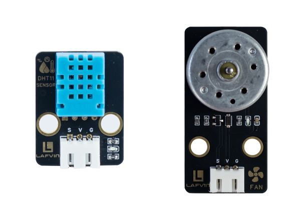
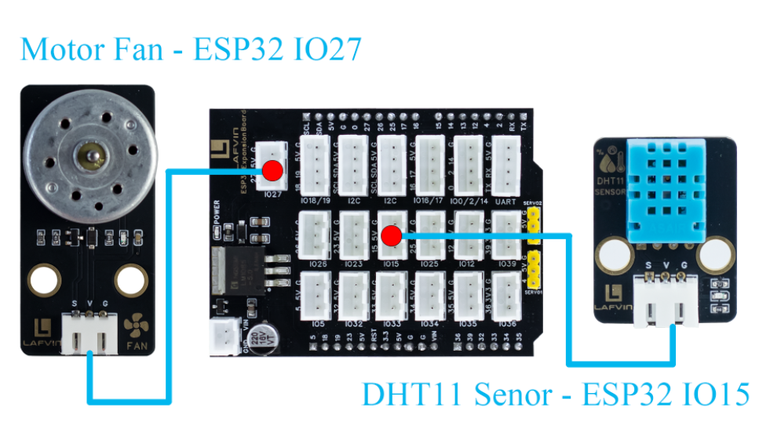
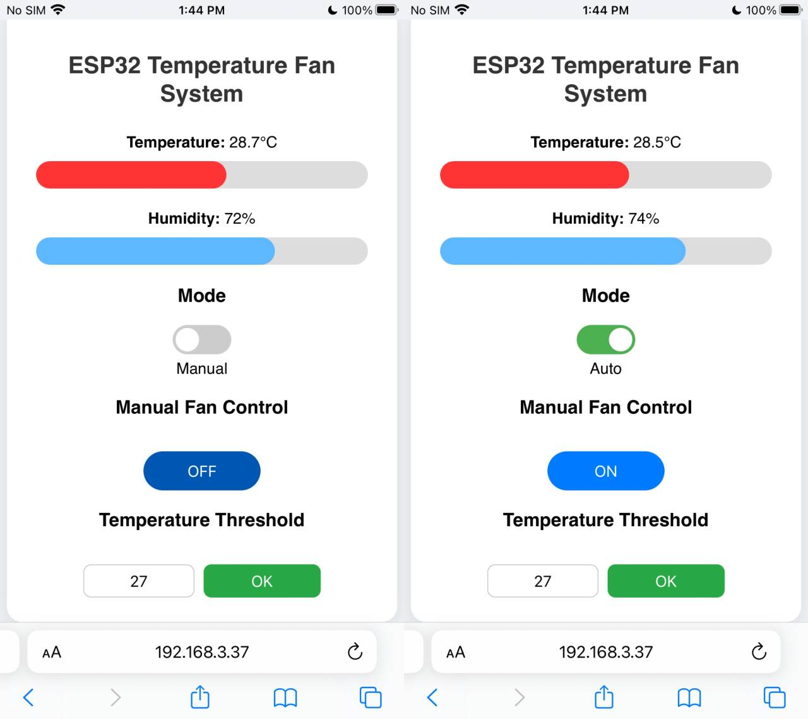

Course 5：TEMP_Fan
==================

----

Learning Objectives
-------------------

 - Learn the working principle and data communication method of the DHT11 temperature and humidity sensor;

 - Master the method of reading temperature and humidity data using ESP32;

 - Understand the application of single-bus communication protocol in sensor data acquisition.

----

Required Component
------------------

 - Motor Fan Module、DHT11 Senor

----

Working Principle
-----------------

 - The DHT11 is a single-bus digital temperature and humidity sensor that integrates a temperature sensing element, a resistive humidity sensing element, and a signal processing chip.

 - It transmits a 40-bit digital signal sequentially via a single bus, sending the acquired temperature and humidity data to the main controller in pulse-width encoded format to achieve environmental temperature and humidity detection.

 - The 40-bit data（5 bytes in total）consists of: an integer part of humidity, a decimal part of humidity, an integer part of temperature, a decimal part of temperature, and a checksum (the lower 8 bits of the sum of the first four bytes).

----

Wiring
--------

 - Motor Fan Module —— ESP32 IO27
 - DHT11 Senor —— ESP32 IO15

----

Example Code
------------

.. code-block:: cpp

   #include <WiFi.h>
   #include <WebServer.h>
   #include <DHT.h>
   #include <Preferences.h>

   // ========== Pin Definitions ==========
   #define DHTPIN 15
   #define DHTTYPE DHT11
   #define FAN_PIN 27

   DHT dht(DHTPIN, DHTTYPE);
   WebServer server(80);

   // ========== Variables ==========
   float temperature = 0.0;
   float humidity = 0.0;
   float thresholdTemp = 30.0; // Default threshold
   bool autoMode = true;
   bool fanState = false;

   // ========== WiFi Configuration ==========
   const char* apSSID = "TEMP_Fan";  // Access Point SSID (no password)
   const char* apPassword = NULL;           // No password

   String wifiSSID = "";        // Store target WiFi SSID
   String wifiPassword = "";    // Store target WiFi password

   bool isConfigMode = true;    // Configuration mode flag
   bool wifiConnected = false;  // WiFi connection status

   // ========== Preferences for storing WiFi credentials ==========
   Preferences preferences;

   // ========== Read Sensor ==========
   void readDHT() {
     temperature = dht.readTemperature();
     humidity = dht.readHumidity();
   }

   // ========== HTML Configuration Page ==========
   String configHTMLPage() {
     String page = R"rawliteral(
   <!DOCTYPE html>
   <html lang="en">
   <head>
   <meta charset="UTF-8">
   <meta name="viewport" content="width=device-width, initial-scale=1.0">
   <title>ESP32 WiFi Configuration</title>
   
   </head>
   <body>
   

     <h2>WiFi Configuration</h2>
     <form action='/configure' method='POST'>
       <input type='text' name='ssid' placeholder='WiFi SSID' required>
       <input type='password' name='password' placeholder='WiFi Password' required>
       <button type='submit'>Connect</button>
     </form>
   

   </body>
   </html>
   )rawliteral";
     return page;
   }

   // ========== HTML Control Page (Original Design) ==========
   String controlHTMLPage() {
     String page = R"rawliteral(
   <!DOCTYPE html>
   <html lang="en">
   <head>
   <meta charset="UTF-8">
   <meta name="viewport" content="width=device-width, initial-scale=1.0">
   <title>ESP32 Human Body Detection System</title>
   
   </head>
   <body>
   

     <h2>ESP32 Temperature Fan System</h2>

     

       <b>Temperature:</b> 0°C
       

     

     

       <b>Humidity:</b> 0%
       

     

     <h3>Mode</h3>
     <label class="switch">
       <input type="checkbox" id="autoToggle" onchange="toggleMode()">
       
     </label>
     
Auto

     <h3>Manual Fan Control</h3>
     <button id="fanBtn" onclick="toggleFan()">OFF</button>

     <h3>Temperature Threshold</h3>
     <input type="number" id="thInput" step="0.1" min="10" max="50" value="30.0">
     <button class="ok-btn" onclick="setThreshold()">OK</button>
   

   
   </body>
   </html>
   )rawliteral";
     return page;
   }

   // ========== Request Handlers ==========
   void handleRoot() {
     if (isConfigMode) {
       server.send(200, "text/html", configHTMLPage());
     } else {
       server.send(200, "text/html", controlHTMLPage());
     }
   }

   void handleData() {
     readDHT();
     if (autoMode) {
       if (temperature >= thresholdTemp) fanState = true;
       else fanState = false;
       digitalWrite(FAN_PIN, fanState ? HIGH : LOW);
     }
     String json = "{";
     json += "\"temperature\":" + String(temperature,1) + ",";
     json += "\"humidity\":" + String(humidity,0) + ",";
     json += "\"autoMode\":" + String(autoMode ? "true" : "false") + ",";
     json += "\"fanState\":" + String(fanState ? "true" : "false");
     json += "}";
     server.send(200, "application/json", json);
   }

   void handleToggleMode() {
     autoMode = !autoMode;
     Serial.println(autoMode ? "Mode: Auto" : "Mode: Manual");
     server.send(200, "text/plain", "ok");
   }

   void handleToggleFan() {
     if (!autoMode) {
       fanState = !fanState;
       digitalWrite(FAN_PIN, fanState ? HIGH : LOW);
       Serial.println(fanState ? "Fan ON (Manual)" : "Fan OFF (Manual)");
     }
     server.send(200, "text/plain", "ok");
   }

   void handleSetThreshold() {
     if (server.hasArg("val")) thresholdTemp = server.arg("val").toFloat();
     Serial.println("Threshold set to: " + String(thresholdTemp,1) + "°C");
     server.send(200, "text/plain", "ok");
   }

   void handleConfigure() {
     wifiSSID = server.arg("ssid");
     wifiPassword = server.arg("password");
     
     // Save credentials to preferences
     preferences.putString("ssid", wifiSSID);
     preferences.putString("password", wifiPassword);
     
     server.send(200, "text/html", 
                 "<html><body><h2>Connecting to WiFi...</h2>"
                 "
SSID: " + wifiSSID + "
"
                 "
Device will restart and attempt connection.
"
                 ""
                 "</body></html>");
     
     delay(2000);
     ESP.restart();
   }

   // ========== Connect to WiFi ==========
   bool connectToWiFi() {
     if (wifiSSID == "") return false;
     
     Serial.println("Attempting to connect to WiFi: " + wifiSSID);
     WiFi.begin(wifiSSID.c_str(), wifiPassword.c_str());
     
     int attempts = 0;
     while (WiFi.status() != WL_CONNECTED && attempts < 20) {
       delay(500);
       Serial.print(".");
       attempts++;
     }
     
     if (WiFi.status() == WL_CONNECTED) {
       Serial.println("\nWiFi connected successfully!");
       Serial.println("IP address: " + WiFi.localIP().toString());
       return true;
     } else {
       Serial.println("\nFailed to connect to WiFi");
       return false;
     }
   }

   // ========== Setup Access Point ==========
   void setupAccessPoint() {
     Serial.println("Setting up Access Point...");
     WiFi.softAP(apSSID, apPassword);
     Serial.println("Access Point started");
     Serial.println("SSID: " + String(apSSID));
     Serial.println("Password: None (Open Network)");
     Serial.println("IP address: " + WiFi.softAPIP().toString());
   }

   // ========== Setup ==========
   void setup() {
     Serial.begin(115200);
     pinMode(FAN_PIN, OUTPUT);
     dht.begin();

     // Initialize preferences
     preferences.begin("wifi-config", false);
     
     // Try to load saved WiFi credentials
     wifiSSID = preferences.getString("ssid", "");
     wifiPassword = preferences.getString("password", "");
     
     Serial.println("=== ESP32 Temperature Fan System ===");
     
     if (wifiSSID != "" && connectToWiFi()) {
       // Successfully connected to WiFi
       isConfigMode = false;
       wifiConnected = true;
       Serial.println("Mode: Station (Connected to WiFi)");
     } else {
       // Enter configuration mode (Access Point)
       isConfigMode = true;
       wifiConnected = false;
       setupAccessPoint();
       Serial.println("Mode: Access Point (Configuration)");
     }

     server.on("/", handleRoot);
     server.on("/data", handleData);
     server.on("/toggleMode", handleToggleMode);
     server.on("/toggleFan", handleToggleFan);
     server.on("/setThreshold", handleSetThreshold);
     server.on("/configure", HTTP_POST, handleConfigure);
     
     server.begin();
     Serial.println("Web server started");
   }

   void loop() {
     server.handleClient();
   }

----

**Code burning options**

1. You can directly copy the code provided above into the Arduino IDE for burning.

2. Find the **5.TEMP_Fan.ino** file in the provided folder, download it, open it with the **Arduino IDE**, and burn the program to the ESP32 development board.

3. Find the **5.TEMP_Fan.bin** file in the provided folder, download it and use **Flash Download Tool** to flash the program to the ESP32 development board. 

----

Effects Demonstration
---------------------

1. The webpage displays temperature and humidity values.

2. The system supports switching between manual and automatic modes. In manual mode, the fan can be manually turned on and off via a web button. In automatic mode, the system will automatically turn on the fan to cool down when the ambient temperature reaches a preset threshold, and will automatically turn off when the temperature drops below the threshold.

3. New temperature thresholds can be set via the webpage.

----
