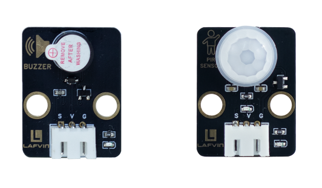
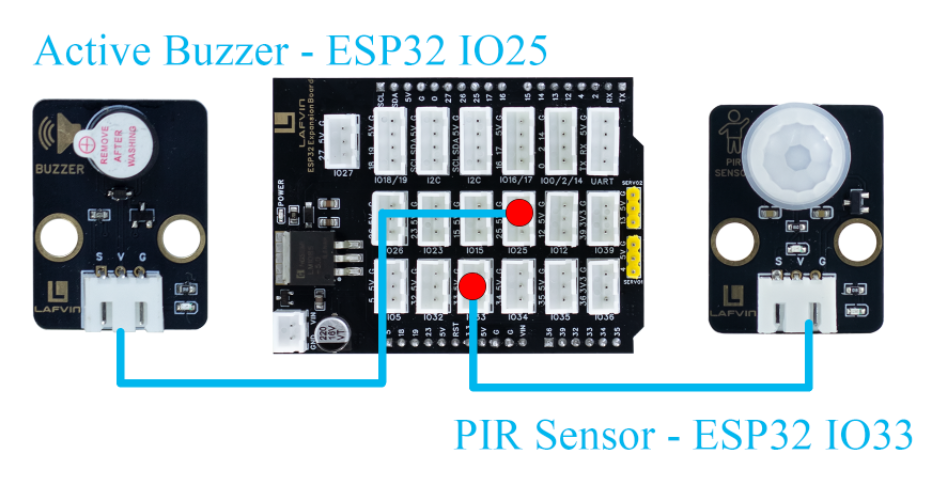
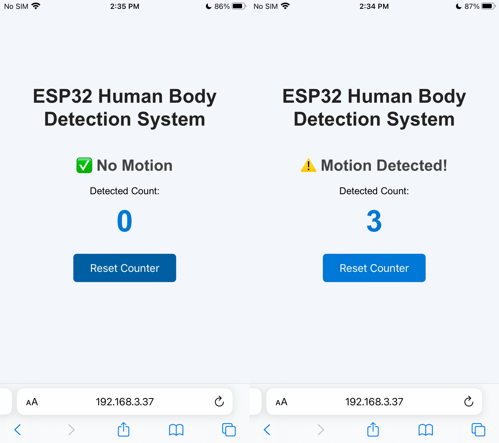

Course 6：Human_Count
=====================

----

Learning Objectives
-------------------

 - Understand the detection principle of PIR infrared human body sensors

 - Master the digital input detection and interrupt handling mechanism of ESP32

 - Learn to use a web server to build a local web interface for real-time data viewing and control

----

Required Component
------------------

 - Active Buzzer、PIR Senor

----

Working Principle
-----------------

 - An active buzzer internally consists of an oscillation circuit and a piezoelectric ceramic element. When a DC voltage is supplied externally, the internal oscillation circuit automatically generates an audio signal to drive the piezoelectric element to vibrate, thus producing sound.

 - A PIR（Passive Infrared Sensor） operates using the pyroelectric effect.When an object with a different temperature （such as a human body） enters its detection area, the infrared radiation emitted by the human body（wavelength approximately 10 μm）causes a change in the charge on the sensor surface, thereby generating a weak electrical signal.

----

Wiring
--------

 - Active Buzzer —— ESP32 IO25
 - PIR Senor —— ESP32 IO33

----

Example Code
------------

.. code-block:: cpp

   #include <WiFi.h>
   #include <WebServer.h>
   #include <Preferences.h>

   // ======== Pin Definitions ========
   #define PIR_PIN 33
   #define BUZZER_PIN 25

   WebServer server(80);

   volatile bool motionDetected = false;
   unsigned long lastMotionTime = 0;
   int peopleCount = 0;
   bool alarmEnabled = true;

   // ======== WiFi Configuration ========
   const char* apSSID = "Human_Count";  // Access Point SSID (no password)
   const char* apPassword = NULL;          // No password

   String wifiSSID = "";        // Store target WiFi SSID
   String wifiPassword = "";    // Store target WiFi password

   bool isConfigMode = true;    // Configuration mode flag
   bool wifiConnected = false;  // WiFi connection status

   // ======== Preferences for storing WiFi credentials ========
   Preferences preferences;

   // ======== HTML Configuration Page ========
   String configHTMLPage() {
     String html = R"rawliteral(
   <!DOCTYPE html>
   <html>
   <head>
   <meta charset="utf-8">
   <meta name="viewport" content="width=device-width,initial-scale=1">
   <title>ESP32 WiFi Configuration</title>
   
   </head>
   <body>
     

       <h1>WiFi Configuration</h1>
       <form action='/configure' method='POST'>
         <input type='text' name='ssid' placeholder='WiFi SSID' required>
         <input type='password' name='password' placeholder='WiFi Password' required>
         <button type='submit'>Connect</button>
       </form>
     

   </body>
   </html>
   )rawliteral";
     return html;
   }

   // ======== HTML Control Page (Original Design) ========
   String controlHTMLPage() {
     String html = R"rawliteral(
   <!DOCTYPE html>
   <html>
   <head>
   <meta charset="utf-8">
   <meta name="viewport" content="width=device-width,initial-scale=1">
   <title>ESP32 Human Body Detection System</title>
   
   
   </head>
   <body>
     <h1>ESP32 Human Body Detection System</h1>
     
Loading...

     
Detected Count:

     
0

     <button onclick="resetCount()">Reset Counter</button>
   </body>
   </html>
   )rawliteral";
     return html;
   }

   // ======== Request Handlers ========
   void handleRoot() {
     if (isConfigMode) {
       server.send(200, "text/html", configHTMLPage());
     } else {
       server.send(200, "text/html", controlHTMLPage());
     }
   }

   void handleStatus() {
     String motion = motionDetected ? "⚠️ Motion Detected!" : "✅ No Motion";
     String json = "{\"motion\":\"" + motion + "\",\"count\":" + String(peopleCount) + "}";
     server.send(200, "application/json", json);
   }

   void handleReset() {
     peopleCount = 0;
     Serial.println("[Web] Counter Reset");
     server.send(200, "text/plain", "OK");
   }

   void handleConfigure() {
     wifiSSID = server.arg("ssid");
     wifiPassword = server.arg("password");
     
     // Save credentials to preferences
     preferences.putString("ssid", wifiSSID);
     preferences.putString("password", wifiPassword);
     
     server.send(200, "text/html", 
                 "<html><body><h2>Connecting to WiFi...</h2>"
                 "
SSID: " + wifiSSID + "
"
                 "
Device will restart and attempt connection.
"
                 ""
                 "</body></html>");
     
     delay(2000);
     ESP.restart();
   }

   // ======== Connect to WiFi ========
   bool connectToWiFi() {
     if (wifiSSID == "") return false;
     
     Serial.println("Attempting to connect to WiFi: " + wifiSSID);
     WiFi.begin(wifiSSID.c_str(), wifiPassword.c_str());
     
     int attempts = 0;
     while (WiFi.status() != WL_CONNECTED && attempts < 20) {
       delay(500);
       Serial.print(".");
       attempts++;
     }
     
     if (WiFi.status() == WL_CONNECTED) {
       Serial.println("\nWiFi connected successfully!");
       Serial.println("IP address: " + WiFi.localIP().toString());
       return true;
     } else {
       Serial.println("\nFailed to connect to WiFi");
       return false;
     }
   }

   // ======== Setup Access Point ========
   void setupAccessPoint() {
     Serial.println("Setting up Access Point...");
     WiFi.softAP(apSSID, apPassword);
     Serial.println("Access Point started");
     Serial.println("SSID: " + String(apSSID));
     Serial.println("Password: None (Open Network)");
     Serial.println("IP address: " + WiFi.softAPIP().toString());
   }

   // ======== Setup ========
   void setup() {
     Serial.begin(115200);
     pinMode(PIR_PIN, INPUT);
     pinMode(BUZZER_PIN, OUTPUT);
     digitalWrite(BUZZER_PIN, LOW);

     // Initialize preferences
     preferences.begin("wifi-config", false);
     
     // Try to load saved WiFi credentials
     wifiSSID = preferences.getString("ssid", "");
     wifiPassword = preferences.getString("password", "");
     
     Serial.println("=== ESP32 Human Body Detection System ===");
     
     if (wifiSSID != "" && connectToWiFi()) {
       // Successfully connected to WiFi
       isConfigMode = false;
       wifiConnected = true;
       Serial.println("Mode: Station (Connected to WiFi)");
     } else {
       // Enter configuration mode (Access Point)
       isConfigMode = true;
       wifiConnected = false;
       setupAccessPoint();
       Serial.println("Mode: Access Point (Configuration)");
     }

     server.on("/", handleRoot);
     server.on("/status", handleStatus);
     server.on("/reset", handleReset);
     server.on("/configure", HTTP_POST, handleConfigure);
     
     server.begin();
     Serial.println("Web server started");
   }

   // ======== Main Loop ========
   void loop() {
     server.handleClient();

     int pirState = digitalRead(PIR_PIN);
     if (pirState == HIGH && !motionDetected) {
       motionDetected = true;
       peopleCount++;
       Serial.println("[Sensor] Motion detected!");
       if (alarmEnabled) {
         digitalWrite(BUZZER_PIN, HIGH);
         delay(1000);
         digitalWrite(BUZZER_PIN, LOW);
       }
       lastMotionTime = millis();
     }

     if (pirState == LOW && millis() - lastMotionTime > 2000) {
       motionDetected = false;
     }
   }

----

**Code burning options**

1. You can directly copy the code provided above into the Arduino IDE for burning.

2. Find the **6.Human_Count.ino** file in the provided folder, download it, open it with the **Arduino IDE**, and burn the program to the ESP32 development board.

3. Find the **6.Human_Count.bin** file in the provided folder, download it and use **Flash Download Tool** to flash the program to the ESP32 development board. 

----

Effects Demonstration
---------------------

1. The PIR sensor is used to detect human activity. A buzzer sounds when someone is detected passing by.

2. The web interface includes a people counter, displaying the total number of detected people in real time and providing a "Reset Counter" button to reset the count.

----
