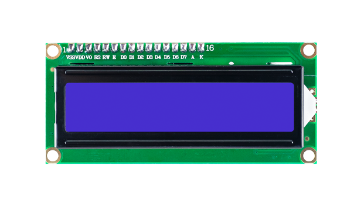
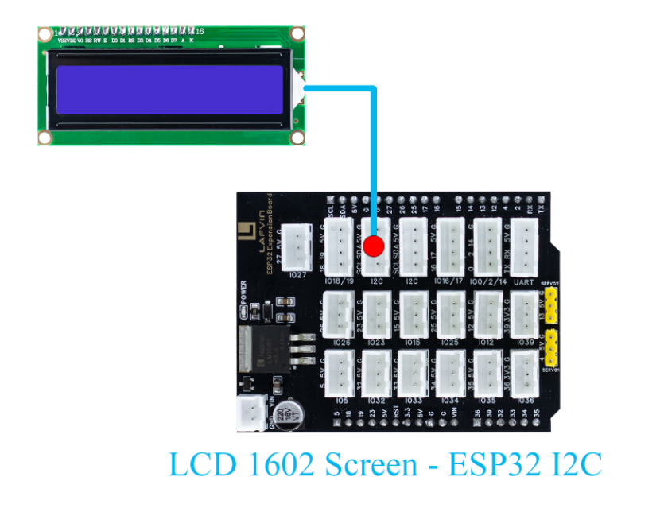
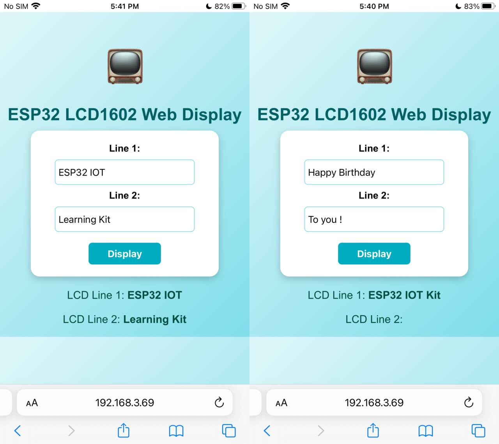

Course 7：LCD_Display
=====================

----

Learning Objectives
-------------------

 - Enables text input via webpage and dynamic display on the LCD1602 LCD screen.

 - Masters core technologies such as I2C communication and display control.

----

Required Component
------------------

 - LCD 1602 Screen

----

Working Principle
-----------------

 - The LCD1602 is a character-type liquid crystal display module that can display two lines, each with 16 characters. It integrates a control chip to receive instructions and data from the microcontroller and control the content displayed on the LCD screen.

----

Wiring
--------

 - LCD 1602 Screen —— ESP32 I2C

----

Example Code
------------

.. code-block:: cpp

   #include <WiFi.h>
   #include <WebServer.h>
   #include <LiquidCrystal_I2C.h>
   #include <Preferences.h>

   // ====== Initialize LCD1602 (address 0x27, 16 columns 2 rows) ======
   LiquidCrystal_I2C lcd(0x27, 16, 2);

   // ====== Create Web Server ======
   WebServer server(80);

   // ====== LCD Display Content Variables ======
   String line1 = "";
   String line2 = "";

   // ====== WiFi Configuration ======
   const char* apSSID = "LCD_Display";  // Access Point SSID (no password)
   const char* apPassword = NULL;          // No password

   String wifiSSID = "";        // Store target WiFi SSID
   String wifiPassword = "";    // Store target WiFi password

   bool isConfigMode = true;    // Configuration mode flag
   bool wifiConnected = false;  // WiFi connection status

   // ====== Preferences for storing WiFi credentials ======
   Preferences preferences;

   // ====== URL Decode Function (handle %20 etc encoding) ======
   String URLDecode(String input) {
     String decoded = "";
     char temp[] = "00";
     unsigned int len = input.length();
     unsigned int i = 0;
     while (i < len) {
       char c = input[i];
       if (c == '+') decoded += ' ';
       else if (c == '%' && i + 2 < len) {
         temp[0] = input[i + 1];
         temp[1] = input[i + 2];
         char decodedChar = (char) strtol(temp, NULL, 16);
         decoded += decodedChar;
         i += 2;
       } else decoded += c;
       i++;
     }
     return decoded;
   }

   // ====== HTML Configuration Page ======
   String configHTMLPage() {
     String html = R"(
   <!DOCTYPE html>
   <html>
   <head>
   <meta charset="UTF-8">
   <meta name="viewport" content="width=device-width, initial-scale=1.0">
   <title>ESP32 WiFi Configuration</title>
   
   </head>
   <body>
     

       <h2>WiFi Configuration</h2>
       <form action="/configure" method="POST">
         

           <label><b>WiFi SSID:</b></label> 
           <input type="text" name="ssid" placeholder="Enter WiFi SSID" required>
         

         

           <label><b>WiFi Password:</b></label> 
           <input type="password" name="password" placeholder="Enter WiFi Password" required>
         

         <input type="submit" value="Connect">
       </form>
     

   </body>
   </html>
   )";
     return html;
   }

   // ====== Generate Webpage HTML ======
   String controlHTMLPage(String msg1, String msg2) {
     String html = R"(
   <!DOCTYPE html>
   <html>
   <head>
   <meta charset="UTF-8">
   <meta name="viewport" content="width=device-width, initial-scale=1.0">
   <title>ESP32 LCD1602 Controller</title>
   
   </head>
   <body>
     
📺

     <h2>ESP32 LCD1602 Web Display</h2>
     <form action="/" method="GET">
       

         <label><b>Line 1:</b></label> 
         <input type="text" name="line1" maxlength="16" placeholder="Enter text for line 1">
       

       

         <label><b>Line 2:</b></label> 
         <input type="text" name="line2" maxlength="16" placeholder="Enter text for line 2">
       

       <input type="submit" value="Display">
     </form>
     

       
LCD Line 1: <b>)" + msg1 + R"(</b>

       
LCD Line 2: <b>)" + msg2 + R"(</b>

     

   </body>
   </html>
   )";
     return html;
   }

   // ====== Route Handlers ======
   void handleRoot() {
     if (isConfigMode) {
       server.send(200, "text/html", configHTMLPage());
     } else {
       // Check for GET parameters
       if (server.hasArg("line1") || server.hasArg("line2")) {
         line1 = server.arg("line1");
         line2 = server.arg("line2");
         
         line1.replace("+", " ");
         line2.replace("+", " ");
         
         line1 = URLDecode(line1);
         line2 = URLDecode(line2);
         
         Serial.println("Line1: " + line1);
         Serial.println("Line2: " + line2);
         
         lcd.clear();
         lcd.setCursor(0, 0);
         lcd.print(line1.substring(0, 16));
         lcd.setCursor(0, 1);
         lcd.print(line2.substring(0, 16));
       }
       server.send(200, "text/html", controlHTMLPage(line1, line2));
     }
   }

   void handleConfigure() {
     wifiSSID = server.arg("ssid");
     wifiPassword = server.arg("password");
     
     // Save credentials to preferences
     preferences.putString("ssid", wifiSSID);
     preferences.putString("password", wifiPassword);
     
     server.send(200, "text/html", 
                 "<html><body><h2>Connecting to WiFi...</h2>"
                 "
SSID: " + wifiSSID + "
"
                 "
Device will restart and attempt connection.
"
                 ""
                 "</body></html>");
     
     delay(2000);
     ESP.restart();
   }

   // ====== Connect to WiFi ======
   bool connectToWiFi() {
     if (wifiSSID == "") return false;
     
     Serial.println("Attempting to connect to WiFi: " + wifiSSID);
     WiFi.begin(wifiSSID.c_str(), wifiPassword.c_str());
     
     int attempts = 0;
     while (WiFi.status() != WL_CONNECTED && attempts < 20) {
       delay(500);
       Serial.print(".");
       attempts++;
     }
     
     if (WiFi.status() == WL_CONNECTED) {
       Serial.println("\nWiFi connected successfully!");
       Serial.println("IP address: " + WiFi.localIP().toString());
       return true;
     } else {
       Serial.println("\nFailed to connect to WiFi");
       return false;
     }
   }

   // ====== Setup Access Point ======
   void setupAccessPoint() {
     Serial.println("Setting up Access Point...");
     WiFi.softAP(apSSID, apPassword);
     Serial.println("Access Point started");
     Serial.println("SSID: " + String(apSSID));
     Serial.println("Password: None (Open Network)");
     Serial.println("IP address: " + WiFi.softAPIP().toString());
   }

   void setup() {
     Serial.begin(115200);

     // Initialize LCD
     lcd.init();
     lcd.backlight();
     lcd.clear();
     lcd.setCursor(0, 0);
     lcd.print("Initializing...");

     // Initialize preferences
     preferences.begin("wifi-config", false);
     
     // Try to load saved WiFi credentials
     wifiSSID = preferences.getString("ssid", "");
     wifiPassword = preferences.getString("password", "");
     
     Serial.println("=== ESP32 LCD1602 Controller ===");
     
     if (wifiSSID != "" && connectToWiFi()) {
       // Successfully connected to WiFi
       isConfigMode = false;
       wifiConnected = true;
       Serial.println("Mode: Station (Connected to WiFi)");
       
       lcd.clear();
       lcd.setCursor(0, 0);
       lcd.print("WiFi Connected!");
       lcd.setCursor(0, 1);
       lcd.print(WiFi.localIP().toString());
     } else {
       // Enter configuration mode (Access Point)
       isConfigMode = true;
       wifiConnected = false;
       setupAccessPoint();
       Serial.println("Mode: Access Point (Configuration)");
       
       lcd.clear();
       lcd.setCursor(0, 0);
       lcd.print("AP: " + String(apSSID));
       lcd.setCursor(0, 1);
       lcd.print("Config Mode");
     }

     // Web server routes
     server.on("/", handleRoot);
     server.on("/configure", HTTP_POST, handleConfigure);
     
     server.begin();
     Serial.println("Web server started");
   }

   void loop() {
     server.handleClient();
   }

----

**Code burning options**

1. You can directly copy the code provided above into the Arduino IDE for burning.

2. Find the **7.LCD_Display.ino** file in the provided folder, download it, open it with the **Arduino IDE**, and burn the program to the ESP32 development board.

3. Find the **7.LCD_Display.bin** file in the provided folder, download it and use **Flash Download Tool** to flash the program to the ESP32 development board. 

----

Effects Demonstration
---------------------

1. You can enter custom text content on the webpage, and it will be displayed on the LCD1602 screen in real time. 

2. Each line can contain a maximum of 16 characters（including spaces）, and any lines exceeding this limit will be automatically truncated.

----
