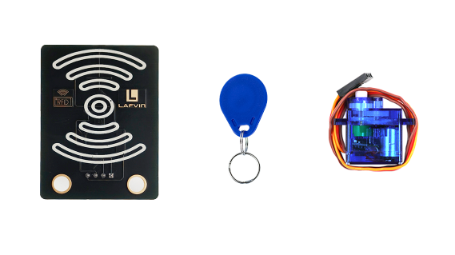
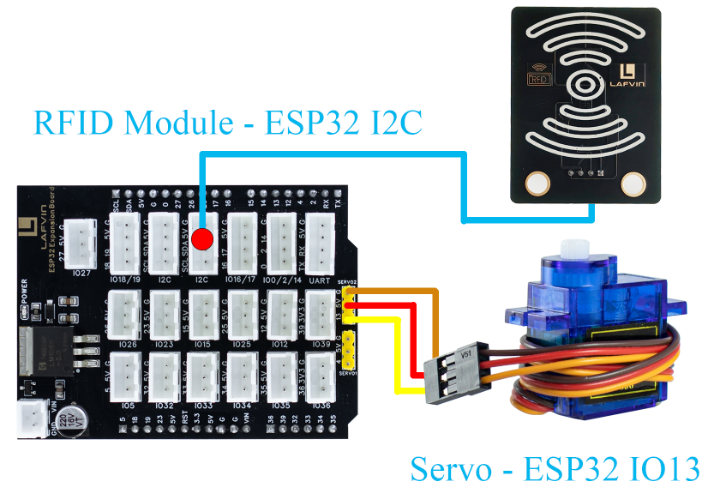
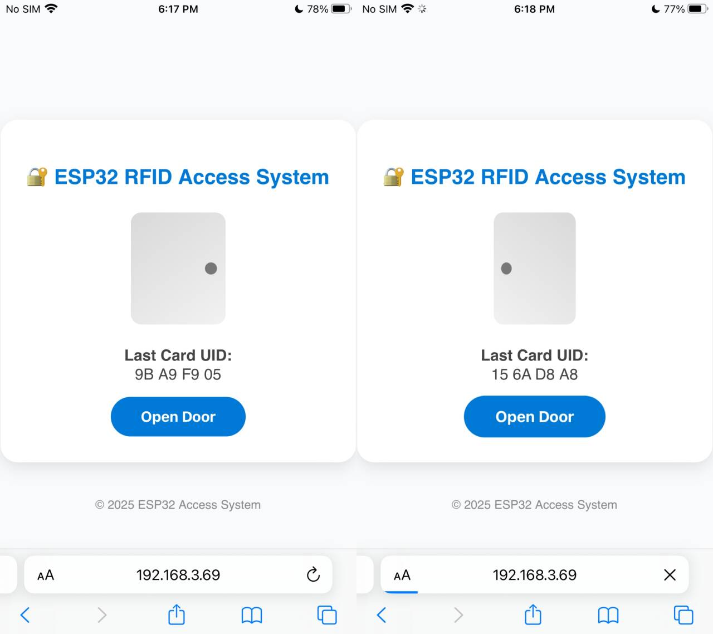

Course 8：RFID_Door
=====================

----

Learning Objectives
-------------------

 - Learn and master the basic principles and implementation methods of ESP32-controlled RFID access control systems.

 - Understand the working mechanism of the RC522 RFID module.

 - Master core technologies such as I2C communication and servo motor control.

----

Required Component
------------------

 - RFID Module、ID Card、SG90 Servo

----

Working Principle
-----------------

 - RFID（Radio Frequency Identification）is a contactless automatic identification technology that uses radio waves to enable data communication between tags and readers.

 - When an RFID card enters the reader's radio frequency field, it gains energy through electromagnetic induction and exchanges data with the reader.

----

Wiring
--------

 - RFID Module —— ESP32 I2C
 - SG90 Servo —— ESP32 IO13

----

Example Code
------------

.. code-block:: cpp

   #include <WiFi.h>
   #include <WebServer.h>
   #include <Wire.h>
   #include <MFRC522_I2C.h>
   #include <ESP32Servo.h>
   #include <Preferences.h>

   // ======= Hardware Definition =======
   #define RC522_ADDR 0x28
   #define I2C_SDA 21
   #define I2C_SCL 22
   #define SERVO_PIN 13
   #define OPEN_ANGLE 90
   #define CLOSE_ANGLE 0
   #define OPEN_TIME 3000

   // ======= WiFi Configuration =======
   const char* apSSID = "RFID_Door";  // Access Point SSID (no password)
   const char* apPassword = NULL;       // No password

   String wifiSSID = "";        // Store target WiFi SSID
   String wifiPassword = "";    // Store target WiFi password

   bool isConfigMode = true;    // Configuration mode flag
   bool wifiConnected = false;  // WiFi connection status

   // ======= Objects =======
   MFRC522_I2C mfrc522(RC522_ADDR, 0xFF);
   Servo doorServo;
   WebServer server(80);
   Preferences preferences;

   String lastCardUID = "None";

   // ======= Function Declarations =======
   void handleRoot();
   void handleOpen();
   void handleUID();
   void handleConfigure();
   void openDoor();
   String getHTML();
   String getConfigHTML();
   bool connectToWiFi();
   void setupAccessPoint();

   void setup() {
     Serial.begin(115200);
     Wire.begin(I2C_SDA, I2C_SCL);
     mfrc522.PCD_Init();
     Serial.println("RC522 initialized successfully.");

     doorServo.setPeriodHertz(50);
     doorServo.attach(SERVO_PIN, 500, 2400);
     doorServo.write(CLOSE_ANGLE);

     // Initialize preferences
     preferences.begin("wifi-config", false);
     
     // Try to load saved WiFi credentials
     wifiSSID = preferences.getString("ssid", "");
     wifiPassword = preferences.getString("password", "");
     
     Serial.println("=== ESP32 RFID Access System ===");
     
     if (wifiSSID != "" && connectToWiFi()) {
       // Successfully connected to WiFi
       isConfigMode = false;
       wifiConnected = true;
       Serial.println("Mode: Station (Connected to WiFi)");
     } else {
       // Enter configuration mode (Access Point)
       isConfigMode = true;
       wifiConnected = false;
       setupAccessPoint();
       Serial.println("Mode: Access Point (Configuration)");
     }

     // ===== Web Server Setup =====
     server.on("/", handleRoot);
     server.on("/open", handleOpen);
     server.on("/uid", handleUID);
     server.on("/configure", HTTP_POST, handleConfigure);
     server.begin();
     Serial.println("Web Server started.");
   }

   void loop() {
     server.handleClient();

     // Check RFID Card
     if (mfrc522.PICC_IsNewCardPresent() && mfrc522.PICC_ReadCardSerial()) {
       lastCardUID = "";
       for (byte i = 0; i < mfrc522.uid.size; i++) {
         if (mfrc522.uid.uidByte[i] < 0x10) lastCardUID += "0";
         lastCardUID += String(mfrc522.uid.uidByte[i], HEX);
         if (i < mfrc522.uid.size - 1) lastCardUID += " ";
       }
       lastCardUID.toUpperCase();
       Serial.println("Detected Card UID: " + lastCardUID);

       openDoor();
       mfrc522.PICC_HaltA();
       mfrc522.PCD_StopCrypto1();
     }
   }

   // ===== Door Control =====
   void openDoor() {
     Serial.println("Door opening...");
     doorServo.write(OPEN_ANGLE);
     delay(OPEN_TIME);
     doorServo.write(CLOSE_ANGLE);
     Serial.println("Door closed.");
   }

   // ===== Connect to WiFi =====
   bool connectToWiFi() {
     if (wifiSSID == "") return false;
     
     Serial.println("Attempting to connect to WiFi: " + wifiSSID);
     WiFi.begin(wifiSSID.c_str(), wifiPassword.c_str());
     
     int attempts = 0;
     while (WiFi.status() != WL_CONNECTED && attempts < 20) {
       delay(500);
       Serial.print(".");
       attempts++;
     }
     
     if (WiFi.status() == WL_CONNECTED) {
       Serial.println("\nWiFi connected successfully!");
       Serial.println("IP address: " + WiFi.localIP().toString());
       return true;
     } else {
       Serial.println("\nFailed to connect to WiFi");
       return false;
     }
   }

   // ===== Setup Access Point =====
   void setupAccessPoint() {
     Serial.println("Setting up Access Point...");
     WiFi.softAP(apSSID, apPassword);
     Serial.println("Access Point started");
     Serial.println("SSID: " + String(apSSID));
     Serial.println("Password: None (Open Network)");
     Serial.println("IP address: " + WiFi.softAPIP().toString());
   }

   // ===== Configuration Page Handler =====
   void handleConfigure() {
     wifiSSID = server.arg("ssid");
     wifiPassword = server.arg("password");
     
     // Save credentials to preferences
     preferences.putString("ssid", wifiSSID);
     preferences.putString("password", wifiPassword);
     
     server.send(200, "text/html", 
                 "<html><body><h2>Connecting to WiFi...</h2>"
                 "
SSID: " + wifiSSID + "
"
                 "
Device will restart and attempt connection.
"
                 ""
                 "</body></html>");
     
     delay(2000);
     ESP.restart();
   }

   // ===== Root Page Handler =====
   void handleRoot() {
     if (isConfigMode) {
       server.send(200, "text/html", getConfigHTML());
     } else {
       server.send(200, "text/html", getHTML());
     }
   }

   // ===== Web Button Open =====
   void handleOpen() {
     openDoor();
     server.sendHeader("Location", "/");
     server.send(303);
   }

   // ===== AJAX UID =====
   void handleUID() {
     server.send(200, "text/plain", lastCardUID);
   }

   // ===== Configuration Web Page HTML =====
   String getConfigHTML() {
     String html = R"rawliteral(
   <!DOCTYPE html>
   <html>
   <head>
   <meta charset="utf-8">
   <meta name="viewport" content="width=device-width, initial-scale=1.0">
   <title>ESP32 WiFi Configuration</title>
   
   </head>
   <body>
     

       <h2>WiFi Configuration</h2>
       <form action="/configure" method="POST">
         <input type="text" name="ssid" placeholder="WiFi SSID" required>
         <input type="password" name="password" placeholder="WiFi Password" required>
         <button type="submit">Connect</button>
       </form>
     

   </body>
   </html>
   )rawliteral";
     return html;
   }

   // ===== Control Web Page HTML =====
   String getHTML() {
     String html = R"rawliteral(
   <!DOCTYPE html>
   <html>
   <head>
   <meta charset="utf-8">
   <meta name="viewport" content="width=device-width, initial-scale=1.0">
   <title>ESP32 RFID Access System</title>
   
   </head>
   <body>
     

       <h2>🔐 ESP32 RFID Access System</h2>
       

         

       

       

         <strong>Last Card UID:</strong> 
         Loading...
       

       <form action="/open" method="POST">
         <button type="submit" id="btn">Open Door</button>
       </form>
     

     
© 2025 ESP32 Access System

   
   </body>
   </html>
   )rawliteral";
     return html;
   }
----

**Code burning options**

1. You can directly copy the code provided above into the Arduino IDE for burning.

2. Find the **8.RFID_Door.ino** file in the provided folder, download it, open it with the **Arduino IDE**, and burn the program to the ESP32 development board.

3. Find the **8.RFID_Door.bin** file in the provided folder, download it and use **Flash Download Tool** to flash the program to the ESP32 development board. 

----

Effects Demonstration
---------------------

1. Bring the ID card close to the RFID module. Once the system detects the card, the servo motor will automatically rotate, simulating a door opening action.

2. The web interface will display the read card number information in real time, and manual door opening and closing can be achieved through control buttons on the webpage.

----
