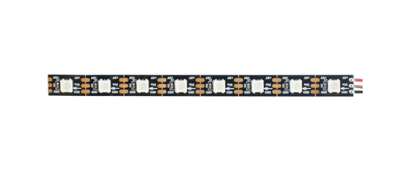
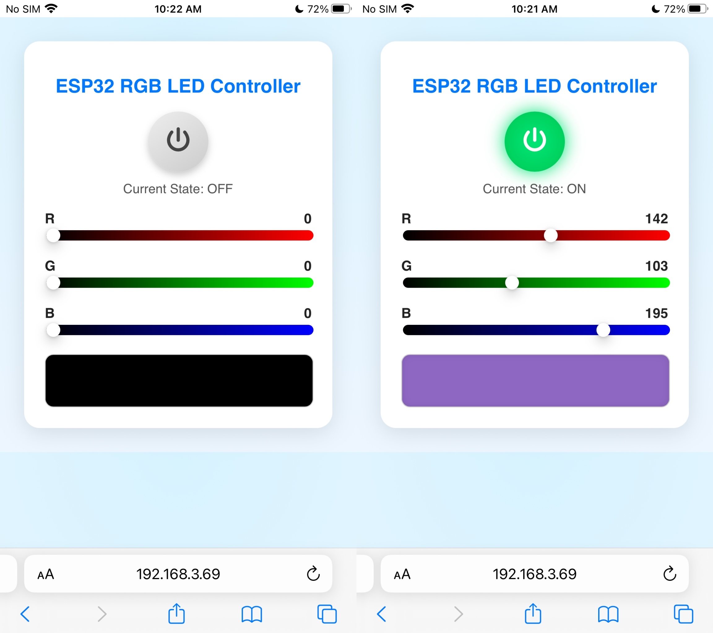

Course 9：RGB_Strip
=====================

----

Learning Objectives
-------------------

 - Learn the basic methods of using ESP32 to control RGB LED strips, understand their color mixing and data transmission principles, and implement web-based remote control functionality.

----

Required Component
------------------

 - RGB Strip

----

Working Principle
-----------------

 - RGB strip integrate red, green, and blue LEDs with a control chip. Each LED can independently receive and parse 24-bit color data（8 bits R, 8 bits G, 8 bits B）from a single-wire serial bus（DIN pin）.

 - The control chip distinguishes between "0" and "1" using strict timing signals（high and low level pulse width encoding）and sequentially transmits the data to the next LED, thus achieving pixel-by-pixel color control and dynamic lighting effects.

----

Wiring
--------

 - RGB Strip —— ESP32 IO5

.. image:: _static/COURSE/27.rgb.png
  :align: center

----

Example Code
------------

.. code-block:: cpp

   #include <WiFi.h>
   #include <WebServer.h>
   #include <Adafruit_NeoPixel.h>
   #include <Preferences.h>

   // ===== NeoPixel setup =====
   const uint8_t LED_PIN    = 5;   // Data pin for the LED strip
   const uint16_t NUMPIXELS = 8;   // Number of LEDs
   Adafruit_NeoPixel strip(NUMPIXELS, LED_PIN, NEO_GRB + NEO_KHZ800);

   // ===== Web server =====
   WebServer server(80);

   // ===== Current state =====
   bool stripOn = false;
   uint8_t colR = 255;
   uint8_t colG = 0;
   uint8_t colB = 0;

   // ===== WiFi Configuration =====
   const char* apSSID = "RGB_Strip";  // Access Point SSID (no password)
   const char* apPassword = NULL;          // No password

   String wifiSSID = "";        // Store target WiFi SSID
   String wifiPassword = "";    // Store target WiFi password

   bool isConfigMode = true;    // Configuration mode flag
   bool wifiConnected = false;  // WiFi connection status

   // ===== Preferences for storing WiFi credentials =====
   Preferences preferences;

   // Forward declarations
   String htmlPage();
   String configHTMLPage();
   void handleRoot();
   void handleSet();
   void handleConfigure();
   void applyColor();
   bool connectToWiFi();
   void setupAccessPoint();

   void setup() {
     Serial.begin(115200);
     delay(200);

     strip.begin();
     strip.show();
     strip.setBrightness(150);

     // Initialize preferences
     preferences.begin("wifi-config", false);
     
     // Try to load saved WiFi credentials
     wifiSSID = preferences.getString("ssid", "");
     wifiPassword = preferences.getString("password", "");
     
     Serial.println("=== ESP32 RGB LED Controller ===");
     
     if (wifiSSID != "" && connectToWiFi()) {
       // Successfully connected to WiFi
       isConfigMode = false;
       wifiConnected = true;
       Serial.println("Mode: Station (Connected to WiFi)");
     } else {
       // Enter configuration mode (Access Point)
       isConfigMode = true;
       wifiConnected = false;
       setupAccessPoint();
       Serial.println("Mode: Access Point (Configuration)");
     }

     server.on("/", HTTP_GET, handleRoot);
     server.on("/set", HTTP_GET, handleSet);
     server.on("/configure", HTTP_POST, handleConfigure);
     server.begin();
     Serial.println("Web server started!");

     applyColor();
   }

   void loop() {
     server.handleClient();
   }

   // ===== Connect to WiFi =====
   bool connectToWiFi() {
     if (wifiSSID == "") return false;
     
     Serial.println("Attempting to connect to WiFi: " + wifiSSID);
     WiFi.begin(wifiSSID.c_str(), wifiPassword.c_str());
     
     int attempts = 0;
     while (WiFi.status() != WL_CONNECTED && attempts < 20) {
       delay(500);
       Serial.print(".");
       attempts++;
     }
     
     if (WiFi.status() == WL_CONNECTED) {
       Serial.println("\nWiFi connected successfully!");
       Serial.println("IP address: " + WiFi.localIP().toString());
       return true;
     } else {
       Serial.println("\nFailed to connect to WiFi");
       return false;
     }
   }

   // ===== Setup Access Point =====
   void setupAccessPoint() {
     Serial.println("Setting up Access Point...");
     WiFi.softAP(apSSID, apPassword);
     Serial.println("Access Point started");
     Serial.println("SSID: " + String(apSSID));
     Serial.println("Password: None (Open Network)");
     Serial.println("IP address: " + WiFi.softAPIP().toString());
   }

   void handleRoot() {
     if (isConfigMode) {
       server.send(200, "text/html", configHTMLPage());
     } else {
       server.send(200, "text/html", htmlPage());
     }
   }

   void handleSet() {
     if (server.hasArg("on")) {
       String s = server.arg("on");
       stripOn = (s == "1" || s == "true");
     }
     if (server.hasArg("r")) colR = (uint8_t)constrain(server.arg("r").toInt(), 0, 255);
     if (server.hasArg("g")) colG = (uint8_t)constrain(server.arg("g").toInt(), 0, 255);
     if (server.hasArg("b")) colB = (uint8_t)constrain(server.arg("b").toInt(), 0, 255);

     applyColor();
     server.send(200, "text/plain", "OK");
   }

   void handleConfigure() {
     wifiSSID = server.arg("ssid");
     wifiPassword = server.arg("password");
     
     // Save credentials to preferences
     preferences.putString("ssid", wifiSSID);
     preferences.putString("password", wifiPassword);
     
     server.send(200, "text/html", 
                 "<html><body><h2>Connecting to WiFi...</h2>"
                 "
SSID: " + wifiSSID + "
"
                 "
Device will restart and attempt connection.
"
                 ""
                 "</body></html>");
     
     delay(2000);
     ESP.restart();
   }

   void applyColor() {
     if (stripOn) {
       uint32_t c = strip.Color(colR, colG, colB);
       for (uint16_t i = 0; i < NUMPIXELS; i++) strip.setPixelColor(i, c);
     } else {
       for (uint16_t i = 0; i < NUMPIXELS; i++) strip.setPixelColor(i, 0);
     }
     strip.show();
   }

   // ===== Configuration Web Page HTML =====
   String configHTMLPage() {
     String html = R"rawliteral(
   <!DOCTYPE html>
   <html>
   <head>
     <meta charset="utf-8">
     <meta name="viewport" content="width=device-width,initial-scale=1">
     <title>ESP32 WiFi Configuration</title>
     
   </head>
   <body>
     

       <h1>WiFi Configuration</h1>
       <form action="/configure" method="POST">
         <input type="text" name="ssid" placeholder="WiFi SSID" required>
         <input type="password" name="password" placeholder="WiFi Password" required>
         <button type="submit">Connect</button>
       </form>
     

   </body>
   </html>
   )rawliteral";
     return html;
   }

   // ===== Control Web Page HTML =====
   String htmlPage() {
     String html = R"rawliteral(
   <!DOCTYPE html>
   <html>
   <head>
     <meta charset="utf-8">
     <meta name="viewport" content="width=device-width,initial-scale=1">
     <title>ESP32 RGB Controller</title>
     
   </head>
   <body>
     

       <h1>ESP32 RGB LED Controller</h1>
       <button id="powerBtn" title="Power">
         <svg viewBox="0 0 512 512"><path d="M256 0c-17.7 0-32 14.3-32 32v224c0 17.7 14.3 32 32 32s32-14.3 32-32V32c0-17.7-14.3-32-32-32zM384 64c-17.7 0-32 14.3-32 32 0 8.8 3.6 16.8 9.4 22.6C392.6 157.3 416 206.6 416 256c0 88.4-71.6 160-160 160S96 344.4 96 256c0-49.4 23.4-98.7 54.6-137.4C156.4 112.8 160 104.8 160 96c0-17.7-14.3-32-32-32-9.4 0-18.3 4.1-24.3 11.1C65.2 122.1 32 187.6 32 256c0 123.7 100.3 224 224 224s224-100.3 224-224c0-68.4-33.2-133.9-71.7-180.9C402.3 68.1 393.4 64 384 64z"/></svg>
       </button>
       
Current State: OFF

       

         <label>R 255</label>
         <input type="range" id="r" min="0" max="255" value="255">
       

       

         <label>G 0</label>
         <input type="range" id="g" min="0" max="255" value="0">
       

       

         <label>B 0</label>
         <input type="range" id="b" min="0" max="255" value="0">
       

       

     

   
   </body>
   </html>
   )rawliteral";

     return html;
   }

----

**Code burning options**

1. You can directly copy the code provided above into the Arduino IDE for burning.

2. Find the **9.RGB_Strip.ino** file in the provided folder, download it, open it with the **Arduino IDE**, and burn the program to the ESP32 development board.

3. Find the **9.RGB_Strip.bin** file in the provided folder, download it and use **Flash Download Tool** to flash the program to the ESP32 development board. 

----

Effects Demonstration
---------------------

1. The web control page includes: a power button（to turn the RGB lights on and off）, an RGB slider（to adjust the color）, a color preview area, and a status display（ON / OFF）.

----
